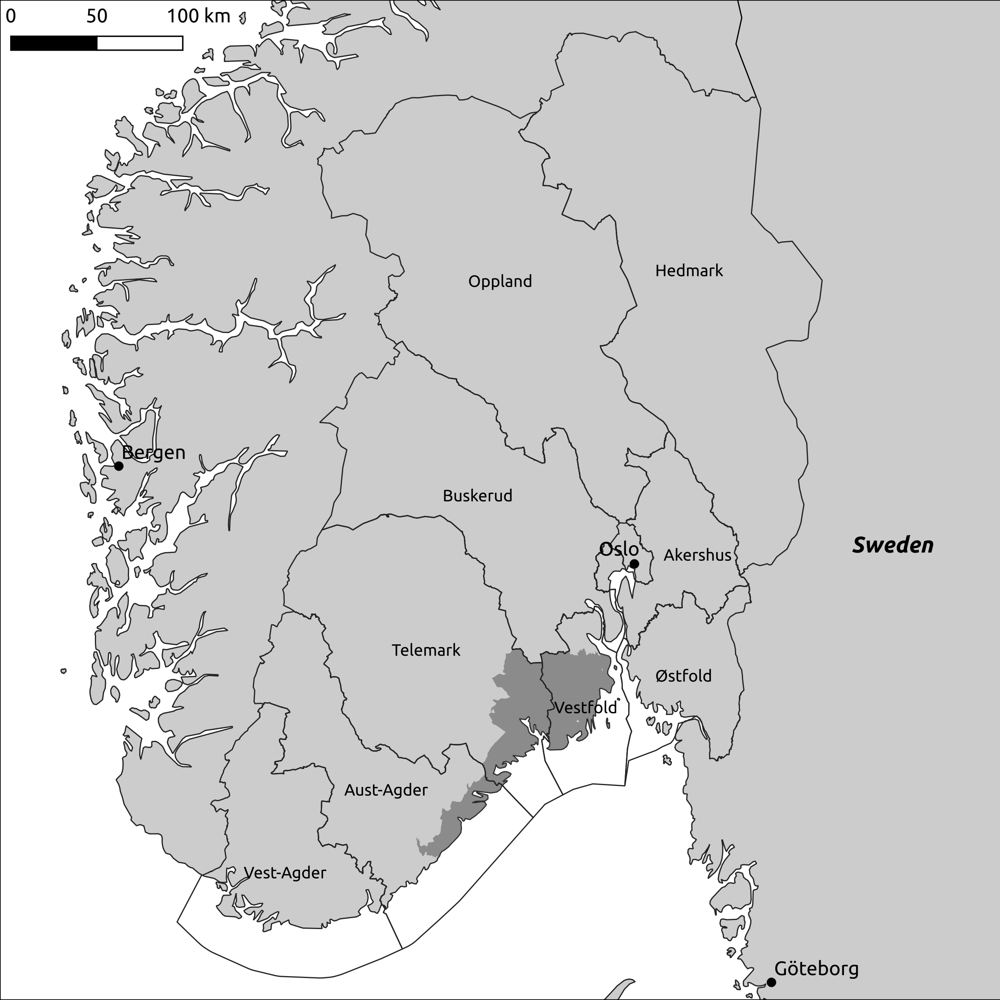
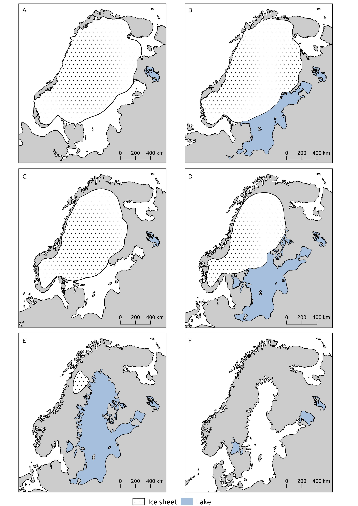
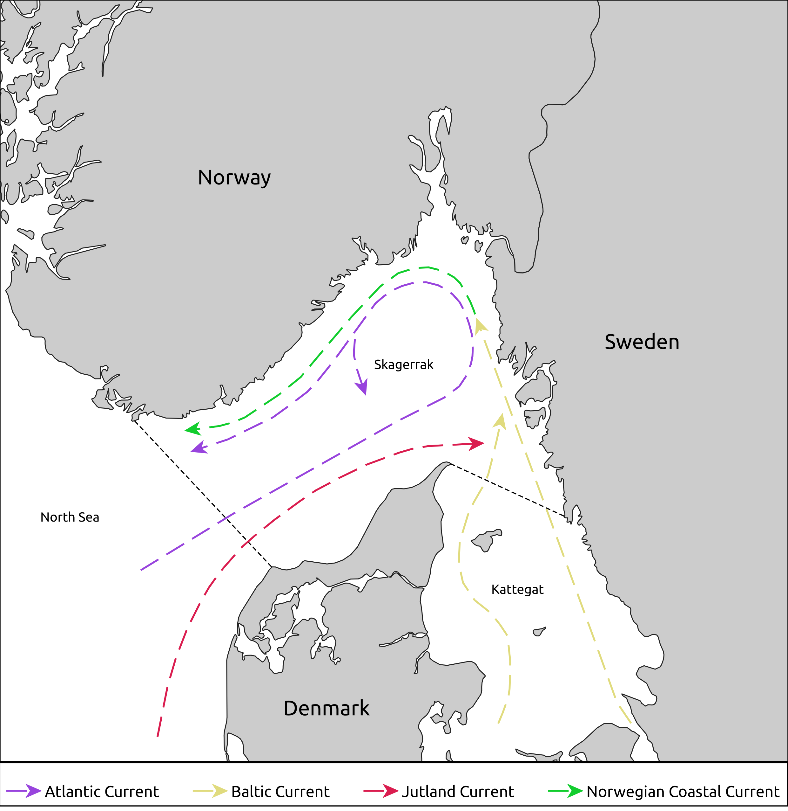

# The Mesolithic in south-eastern Norway

This chapter presents the context of the study, beginning with the overarching environmental developments relevant to the Mesolithic of south-eastern Norway, before general archaeological understandings and discussions of the period is presented. Focus is on the developments in the coastal areas of south-eastern Norway, but insights from studies undertaken in Norway and Sweden more widely will be drawn on at times. The location of the study area is given in Figure \@ref(fig:overview) (see the introduction for a map displaying the location of the study region within Northern Europe).

```{r overview,  echo = FALSE, out.width = "95%", fig.align = "center", fig.cap = "Overview of study area. The darker grey marks the area where the material directly studied in this thesis stems from (see individual papers for details), indicated here by the borders of the municipalities from where the material originates. The counties outlined in black make up the administrative region of the University of Oslo, the Museum of Cultural History. The counties are given as they were defined before 2020, when several of these were combined due to administrative changes. The coastal region from around Göteborg to Vest-Agder is usually considered relatively uniform in terms of material culture throughout the Mesolithic."}

```


## Environmental setting

The environmental setting for the Mesolithic in Scandinavia is first and foremost defined by the end of the last glacial period with the transition to the Holocene around 9700 BCE, following the end of the Younger Dryas cold period [@skar2018; @mangerud2022]. This was caused by changes to the Earth's orbital parameters that led to an increase in solar irradiance [e.g. @berger1991]. Most pronounced of the resulting interrelated environmental developments is the melting of the Fennoscandian Ice Sheet, corresponding relative sea-level change, changes in atmospheric and oceanic circulation impacting temperature and precipitation, as well as the developments of the Baltic Sea, which has transitioned between being open and closed off from the ocean (see Figure \@ref(fig:palaeo-maps)). 

### Climate

Climate reconstructions for the northern hemisphere based on oxygen isotopes from the Greenland ice cores indicate gradually increasing temperatures from c. 9700 BCE [@rasmussen2014], the onset of which generally corresponds, possibly with a slight time-lag, with developments in Fennoscandia and Norway [@seppa2009; @lohne2013; @lohne2014; @manninen2018]. This warming trend is interspersed by a few abrupt climate reversals, mainly caused by freshwater-forced weakening of thermohaline oceanic circulation. The first of these is the Preboreal oscillation (PBO) around 9400 BCE [@bjorck1997], followed by the Erdalen event indicated by glacial re-advances c. 8400 BCE and 7700 BCE [@nesje2009]. The most pronounced of the cooling events occurs c. 6200 BCE [the 8.2ka event @wiersma2006; @seppa2009, correlating with the Finse event identified in glacial records, e.g. @nesje2005]. Although these are the most marked events, sediment cores from the North Atlantic also indicate more environmental fluctuations through the rest of the Holocene than what is indicated in the Greenland ice cores [@nesje2014, 244].

Pollen-based reconstructions from Northern Europe indicate that the trend of increasing temperatures reached the local Holocene thermal maximum c. 6000--2800 BCE, which is around 2000 years later than what is indicated in the Greenland ice cores [@seppa2009; see @sørensen2014b; @wieckowska-luth2017 for south-eastern Norway], likely reflecting a difference between regions primarily influenced by orbital forcing and those affected by the presence of melting ice sheets [@renssen2009]. This warming trend is evident from a range of records, including glacial fluctuations, where Scandinavian glaciers reached their most contracted state around 4600--4000 BCE [@nesje2009]. Furthermore, as the altitudinal tree limit is reflective of thermal conditions, the dating of subfossil pine stems can provide a minimum indicator for this climate proxy. The pine-tree limit in the area of the Hardangervidda mountain plateau in central southern Norway is significantly higher than at present from the Late Boreal and through most of the Atlantic period. When adjusted for isostatic uplift, the limit reached it's highest point at upwards of 240 m above the present limit in the period c. 5200--4200 BCE [@dahl1996]. From around this point on the temperatures decline, with some fluctuations, towards the present, and the climate was increasingly characterised by being colder, wetter and more unstable [@seppa2009], also indicated by decline in pine-tree limits and the reforming and re-advance of glaciers from c. 4000 BCE [@dahl1996; @bjune2006; @nesje2009].

### Deglacation and sea-level change

The Fennoscandian Ice Sheet. With the end of the Younger Dryas [indicated in Figure \@ref(fig:palaeo-maps), but see e.g. @hughes2016; @stroeven2016 for more detailed overviews]. 

On the large time-scale, continental ice sheets have been the primary determinant for relative sea-level variation through the Quaternary [@milne2015]. These effects follow from mass that is gained and lost with  melting and forming ice sheets, leading to. The varying density of ice sheets also leads to corresponding adjustments to the solid Earth and the gravity field. Adjustments in the solid Earth follow from mass loading and unloading, causing the Earth to subside with increased weight and lift upwards with reduced weight. The mass of the ice sheet. These effects are thus most marked in so-called near-field areas, that is, areas that have been covered by the ice. As the Fennoscandia 

The marine limit, that is, the highest elevation of the sea following the retreat of the ice, is around 220 meters above present sea-level (masl) in the innermost part of the Oslo fjord. In Horten, at the northern limit of the study area for this thesis, the marine limit is c. 182 masl [@romundset2021; @berg-hansen2022]. In the centre of the study area, in Porsgrunn, the marine limit is around 155 masl [@sørensen2014], and furthest to the south, in Arendal, c. 83 masl [@romundset2018].   

Furthermore, the rate of sea-level change has varied within the study area and over time. 

### Flora

The increases in temperatures led to a development from Arctic to Boreal vegetation in the early Holocene of south-eastern Norway, with a transition from pioneer species of bushes and grasses, to the establishment of open birch forest towards the end of the 10th millennium BCE [@birks2015; @høeg2018, 194]. This was followed by the marked spread of hazel and pine c. 8500--8000 BCE, with elm and oak following a few hundred years later [@sørensen2014b, 202; @høeg2018]. The spread of various deciduous trees increased in the Atlantic period, and from around 5500 BCE there was a marked increase in oak as well as the introduction of linden, the most heat-demanding of these tree-species [@høeg2018, 199]. 

There is also some regional climatic variation in the present-day coastal areas of south-eastern Norway, where the inner, more sheltered parts of the Oslo fjord has a more continental climate, characterised by warm summers in which most of the precipitation falls, and cold winters. Towards the outer coastal areas the climate is more oceanic in character, with comparatively warmer winters with more precipitation and somewhat colder summers than in the inner coastal areas -- differences that also impact vegetation [@hafsten1956, 16--29].

A note should also be made here that anthropogenic influence on vegetation cover in the Mesolithic is evident from palynological indicators of fire management at some sites [e.g. @selsing2016; @wieckowska-luth2018], and is possibly also related to the spread of hazel through foraging of hazel nuts. However, human-induced changes to vegetation is most pronounced towards the end of the Neolithic with the wide adoption of agriculture [e.g. @hjelle2018; @wieckowska-luth2018; @høeg2018, 199].

```{r palaeo-maps,  echo = FALSE, out.height = "105%", out.width = "105%", fig.align = "center", fig.cap = "Overall trends of deglaciation, relative sea-level change and the Baltic Sea stages. A) Younger Dryas, c. 10 700--9700 BCE; B) Early Preboreal, c. 9700--9200 BCE; C) Late Preboreal, c. 9200--8700 BCE; D) Early Boreal, c. 8700--8000; E) Late Boreal, c. 8000--7200 BCE; F) Late Atlantic, c. 6500--4500 BCE. Data from the European Prehistoric and Historic Atlas, Centre for Baltic and Scandinavian Archaeology (https://zbsa.eu/), with further references therein."}

```


<!-- options(knitr.kable.NA = '') -->
<!-- Period <- c('Preboreal', 'Boreal', 'Atlantic', 'Subboreal', 'Subatlantic') -->
<!-- Duration <- c('9500--8200 BCE', '8200--7000 BCE', '7000--3800 BCE', '3800--750 BCE', '750 BCE--Present') -->
<!-- Conditions <- c("Warm and dry", "Warm and dry", "Warm and wet", "Colder and dry", "Cold and wet") -->

<!-- df <- data.frame(Period, Duration, Conditions) -->

<!-- knitr::kable(df, booktabs = TRUE, -->
<!--       caption = "Approximate duration and general conditions of vegetational/climatic phases (based on Sørensen 2005, Mangerud et al. 1974)", -->
<!--       align = 'l') -->

### Palaeoceonography

An important driver for oceanic and climatic conditions in Norway is the Norwegian Atlantic Current (NwAC), a surface current which carries warm saline waters along the outer Norwegian coast as an extension of the North Atlantic Current. As there is a close connection between atmospheric conditions and upper ocean systems, developments in sea surface temperatures (SST) in the Norwegian Sea correspond with general climatic shifts [@berner2010]. At the transition from the Younger Dryas to the Preboreal there is a rapid increase in SST with increased inflow of Atlantic water, which is characteristic of the conditions through the HTM [@andersen2004]. This trend is also impacted by the cooling PBO, and the Erdalen and Finse events [@berner2010; @rasmussen2014b]. From around 2500 BCE there is a general transition towards lower SST, which is characteristic for the Norwegian Sea for the remainder of the Holocene [@andersen2004].

Zooming in to the palaeoceonographic developments in Skaggerrak, @gyllencreutz2006 identify four major developmental stages. From the period 13 000--11 000 BCE, Skagerrak is a large fjord, open to the west and enclosed by land to the south and the ice-front to the north. Warmer Atlantic water impacts Skagerrak already from the start of this period, but the circulation in Skagerrak is likely to have been weak. At around 11 000 BCE, drainage started from the Baltic Sea, at this stage the Baltic Ice Lake, through the Öresund strait to the south [@andren2011, see Figure \@ref(fig:palaeo-maps)A]. Due to the difference in elevation, this involved a unidirectional outflow of glacial melt-water from the Baltic Ice Lake through the Öresund strait, until the final drainage of the ice lake around 9700 BCE. The resulting Baltic Sea stage, which thus corresponds with the onset of the Holocene, is termed the Yoldia Sea. While the Yoldia Sea had open contact with Skagerrak through straits in south-central Sweden through Lake Vänern and the area around and north of Göteborg, it would take c. 300 years before saline water could enter through the narrow straits [@andren2011, indicated in Figure \@ref(fig:palaeo-maps)B and \@ref(fig:palaeo-maps)C]. Due to isostatic uplift, the Baltic Sea was again closed off from the ocean around 8700 BCE, marking the onset of the Ancylus Lake stage, in which the Baltic sea was a large freshwater lake until c. 6900 BCE (Figure \@ref(fig:palaeo-maps)D and \@ref(fig:palaeo-maps)E). 

In the period from 7500--6100 BCE, the present day circulation patterns are established in Skagerrak. The opening of the English Channel and the isolation of Doggerbank in the North Sea, starting from around 8000 BCE--7000 BCE, resulted in an increased Atlantic inflow to Skagerrak, and in the period from around 8100--6900 BCE the gradual eustatic opening of the Öresund and Danish Straits established an opening to the Baltic Sea in the south, marking the onset of the Littorina Sea stage (Figure \@ref(fig:palaeo-maps)F). In combination, these developments lead @gyllencreutz2006 to consider most major features of the current circulation system in Skagerrak to have been established by c. 6500 BCE [see Figure \@ref(fig:circulation), and @christensen2018].

While the inner parts of the Oslo fjord are sheltered from Skagerrak today, this has followed from relative sea-level change. In addition to a different configuration of the secondary fjord system and different positions for river run-offs, the the fjord itself would have been a larger bay in the earliest part of the Holocene. This has implications for the circulation and salinity of the inner-most parts of the fjord, which would have been more exposed to Skagerrak [@staalstrøm2021] and which would also have had implications for the climatic conditions that today differentiate the inner and outer parts of the fjord [cf. @hafsten1956].

```{r circulation,  echo = FALSE, out.height = "80%", out.width = "105%", fig.align = "center", fig.cap = "Main currents in present-day Skagerrak (redrawn after Staalstrøm et al. 2021:fig.5, see also Christensen et al. 2018)."}

```

### Fauna

The above developments have framed the population dynamics of terrestrial and marine fauna in south-eastern Norway through the Mesolithic, where the transition from Arctic to more temperate conditions led to the displacement of cold-tolerant terrestrial species, and the salinity and temperature of Skagerrak similarly impacted marine species [e.g. @boethius2018; @breivik2014; @damlien2021, 24; @mansrud2018; @jonsson2014; @sørensen2014b]. 

In the transition towards a Boreal climate, terrestrial Arctic species such as reindeer and polar fox moved to the mountain regions, while species such red deer, roe deer, elk, beaver and boar increasingly populated the forest-covered landscape in the lower lying areas [@hufthammer2006; @jonsson1995]. Aurochs and European bison reached at least as far north as central southern Sweden, but likely disappeared with the opening of the Öresund and Danish Straits [@hallgren2018]. Freshwater fish such as pike and perch reached Eastern Norway with the retreat of the ice through river systems from the Ancylus Lake, and anadromous species such as trout, salmon and Arctic char also migrated along the coast [@jonsson1995; @refseth1998]. Furthermore, it also appears that humans transported trout to establish these populations in rivers and lakes in the mountain region already in the Mesolithic -- at least in the 5th millennium BCE [@mjærum2016; @mjærum2020].

Important drivers of Late Holocene bio-productivity in Skagerrak has been nutrient-rich terrestrial inflow from flooding and river run-offs, internal release of nutrients through upwelling, and external influx of nutrients from Baltic and Atlantic waters [@fonselius1996; @polovodovaasteman2018], which is related to the strength and salinity of inflow from the Atlantic Ocean and outflow of brackish water from the Baltic Sea. Comparatively, the influence of the melting ice sheet in the Preboreal, and the constrained outflow and strong tidal current from the Baltic Ice Lake through Lake Vänern, has been argued to have given rise to large amounts of primary phytoplankton in Skagerrak in this period. This would in turn have attracted fish such as capelin and herring, forming the dietary base for a range of sea-birds and higher-thropic species such as whales and seal [@jonsson2014; @schmitt2015]. With the reduced inflow of glacial melt-water and the closing off of the Ancylus Lake in the Boreal, this could have led to a reduction in primary biomass, in turn impacting the abundance and composition of marine fauna [@boethius2018]. 

<!-- interspersed with cold events c. 10 300 cal BP, c. 9200 cal BP and 8200 cal BP -->

## Archaeological background

Having presented the general environmental developments of the period, the following section gives an outline of how chronological and societal developments in the Mesolithic of south-eastern Norway have been characterised and understood archaeologically. As outlined by @bjerck2008[61], the first focused research on the Norwegian Mesolithic is ascribed @hansen1904, who studied the material that @brøgger1905 later saw as a defining element of the Nøstvet culture. In 1909, Nummedal made discoveries of flint artefacts in western Norway that were deemed likely to have an earlier date than the Nøstvet material [@rygh1911; @nummedal1912], and which led to the subsequent definition of another cultural unit termed Fosna [@nummedal1923]. Nummedal later also discovered material in northern Norway that had parallels with, but was considered distinct from Fosna and was given the label Komsa [@nummedal1927]. While the geographical and temporal relationship between these cultural units were recognised as unresolved and was subject to much debate, the common understanding was for many decades that southern Norway was defined by the chronologically sequential phases Fosna and Nøstvet, while Komsa was seen as defining of the entire Mesolithic period in northern Norway [see e.g. @indrelid1978, 147]. 

With renewed debates in the 1970s, that were arguably founded on a better understanding of lithic technology [@bjerck1994], significant alterations to the chronological framework was proposed. @mikkelsen1975 suggested a quadripartite division of the Mesolithic in south-eastern Norway by dividing the period into the Early Mesolithic Fosna phase, the Middle Mesolithic Tørkop phase, and the Late Mesolithic phases Nøstvet and Kjeøy. While there have been subsequent discussions and adjustments [e.g. @glørstad2004; @jaksland2001], the chronology used to characterise the Mesolithic of south-eastern Norway has generally followed along the lines of the framework used by @glorstad2010[23, see Table \@ref(tab:tab1)]. 

In a comprehensive reassessment that also includes results from the last decades of excavations, @reitan2022 has recently suggested a new chronological framework for the Mesolithic period in south-eastern Norway [also @reitan2016]. As his focus has mainly been on technological and typo-chronological developments, and given their recent date of publication, this framework has yet to be comprehensively evaluated in terms of correspondence with other societal developments. The presentation of major chronological trends in the sections below thus follows the traditional periodisation, as this underlies most of the cited studies.  As the papers for this thesis largely operate independently of this periodisation, as will be presented in more detail in later chapters, the chronological framework used here is mainly meant to set a heuristic and general frame of reference for the developments that are believed to have characterised the Mesolithic in the region.

<!-- However, in the discussion chapter, the results of this thesis will also be seen in relation to the framework suggested by Reitan. -->

```{r tab1, echo = FALSE}
options(knitr.kable.NA = '')
Period <- c('Glørstad (2010)','Early Mesolithic, Fosna Phase', 'Middle Mesolithic, Tørkop Phase', 'Late Mesolithic, Nøstvet Phase', 'Late Mesolithic, Kjeøy Phase', NA,
            'Reitan (2022)','Single-edged point phase', 'Høgnipen point phase', 'Microlith Phase', 'Pecked Adze Phase', 'Nøstvet Adze Phase', 'Transverse Arrowhead Phase')
Duration <- c(NA, "9300–8200 BCE", "8200–6300 BCE", "6300–4600 BCE", "4600–3800 BCE", NA, NA, "9300–8600 BCE", "8600–8300 BCE", "8300–7000 BCE", "7000–5600 BCE", "5600–4500 BCE", "4500–3900 BCE")
# framework <- c(rep("Glørstad (2010)", 4), rep("Reitan (2022)", 6))

df <- data.frame(Period, Duration)

# dplyr::select(df, -framework)
knitr::kable(df, booktabs = TRUE, linesep = "",
      caption = "Chronological framework. Glørstad's (2010) divison of phases reflects the more traditional framework, to which Reitan (2016, 2022) has recently suggested considerable adjustments.",
      col.names = NULL, align = 'l')
# kableExtra::pack_rows(tbl,
#                       index = c("Glørstad (2010)" = 4, "Reitan (2022)" = 5))  


```

Before the 1990s, the Mesolithic material from south-eastern Norway was mainly derived from stray finds [e.g. @bjørn1943; @hagen1946] and the excavation of a few individual sites [e.g. @mikkelsen1975; @mikkelsen1999; @østmo1976]. From around the 1990s and onwards, there has been a dramatic increase in excavations of Mesolithic sites in south-eastern Norway. This extends from smaller scale investigations of individual sites [see @damlien2021 for a recent overview], to larger multi-year projects in the counties of Østfold [@glørstad], Hedmark [@boaz1999; @stene2010; @stene2019], Vestfold and Telemark [@melvold2014b; @jaksland2014; @solheim2017b; @berg-hansen2022], Vest-Agder [@ballin1995], Øst-Agder [@reitan2018c], and Akershus [@ballin1998; @jaksland2001; @rosenvinge2022]. The material used for this study stems from Vestfold, Telemark and Vest-Agder (Figure \@ref(fig:overview)). This study area is located firmly within what has been considered an area of comparable material culture throughout the Mesolithic in the northern Skagerrak area.

### The Early Mesolithic (9300--8300 BCE)

The first human presence in Norway is recorded from around 9300 BCE, which marks the start of the EM. A central discussion has concerned whether people first migrated into the area of present-day Norway from a route along the coast of western Sweden, from the north-east along the North-Norwegian coast [@bjørn1929], or across the Norwegian trench to south-western Norway from Doggerbank [@odner1966, 135--136]. The most recent evidence suggest that a crossing from Doggerbank would not have been feasible due to the distances involved at the time [@glorstad2016; @glorstad2017]. The present consensus is therefore that the earliest human dispersal into present-day Norway is likely to have originated on the coast of western Sweden around 9500--9300 BCE [e.g. @bang-andersen2012; @fuglestvedt2012; @glorstad2020; @bjerck2008; @bjerck2021]. From here, human occupation is believed to have rapidly extended along most of the Norwegian coastline, while a north-eastern migration reached Kola and northern Norway some time before 9000 BCE [@manninen2021]. These two routes are associated with the genetically defined \'western\' hunter-gatherers that migrated from the south, and \'eastern\' hunter-gatherers migrating from the north [@gunther2018], each identifiable also in terms of distinct material culture and associated technological traits [@manninen2021].

 <!-- (f.eks. Bjerck 2008c:74; Glørstad 2010a:91-93) -->

Pioneer sites in Norway and Western Sweden have traditionally been ascribed the archaeological cultures or techno-complexes Fosna and Hensbacka, respectively. Today these are seen as representing the same phenomena [e.g. @bjerck2008, 75]. Fosna/Hensbacka sites are to have fairly homogeneous lithic inventories, and are held by many as having a common origin tracing back to South-Scandinavian and North-European Palaeolithic Ahrensburg groups [e.g. @bjerck2008; @schmitt2009; @bang-andersen2012; @fuglestvedt2012]. The analyses of artefact inventories, the presence of high-quality South-Scandinavian flint, and the chronological support of radiocarbon dates have in sum led to the consensus on this continental connection [e.g. @bang-andersen2012; @fischer1996; @schmitt2006; @fuglestvedt2007; @fuglestvedt2009; @glorstad2016]. 

These similarities has even led @fuglestvedt2012[8] to propose that the terms Fosna/Hensbacka be abandoned altogether, in favour of Ahrensburg, as this would accentuate the continental elements that appear so defining for these pioneer sites. Although this has been met with varying degrees of enthusiasm [e.g. @åstveit2014, with comments; @bjerck2008, 73], particularly by those emphasising the strong marine orientation of the Fosna/Hensbacka, there has also been the occasional use of variations such as 'coastal Ahrensburg' to denote the Fosna/Hensbacka [@prøsch-danielsen1995]. Following a recent analysis of lithic inventories from the transition from the Palaeolithic to the Mesolithic in Northern Europe, and comparison with Fosna/Hensbacka sites in Norway and Sweden, @berg-hansen2017[] has argued that the Fonsa/Hensbacka sites have a clear similarity with EM Maglemose sites in Denmark. While there are elements of this technology that point back to the Ahrensburg, there is also a clear break with the Palaeolithic technology. She therefore argues that these societies should, as with the Maglemose, be considered Mesolithic and not a northern continuation of Palaeolithic life-ways. At any rate, these discussions do go to show that there is a clear affinity between the first human population on the Scandinavian Peninsula and continental hunter-gatherer groups.

To account for the apparent pan-regional homogeneity that is to characterise the archaeological material in the earliest part of the Mesolithic, a central question is by what process Norway and western Sweden were initially colonised [e.g. @bang-andersen2012; @bjerck2009; @schmitt2009; @fuglestvedt2012; @glorstad2016; @berg-hansen2017]. An important aspect in this regard is the fact that the coastal areas in western Norway were largely ice-free around 3000 years before the first recorded human presence in Norway [@mangerud2022], and must have been rich and desirable areas in terms of resources early on [@bjerck1994; @bjerck2009; @bang-andersen2012; @glorstad2016]. 

Bjerck [-@bjerck1994; @bjerck2008, 85; @bjerck2009; @bjerck2017] has explained the fact that people did not start exploiting these regions until around 9300 BC with reference to less developed marine subsistence strategies among North-European hunter-gatherer groups. The coastal location of the majority of Fosna/Hensbacka sites will undoubtedly have necessitated extensive adjustment to marine environments, including by the use of boats. Following the delay induced by this, the hunting of seal, conceptually not that different from the hunting of large terrestrial mammals, might have spurred an increased development of boating technology, while at the same time lending itself to the continued use of a continental artefact inventory [@bjerck2009; @bjerck2016]. Proficient and effective use of boats might in turn have resulted in a relatively rapid colonisation of Fosna/Hensbacka areas, possibly as fast as over a period of only 200--300 years [@bjerck1994; @bang-andersen2012], providing a possible explanation for the homogeneous assemblages. These could reflect mobility of a kind not allowing for familiarisation with local resources for tool production, nor the development of distinct inventories adjusted to various geographical settings. The assemblages might therefore represent a sort of catch-all tool-kit, suitable to meet the variable demands of a \'pioneer condition\' [@bjerck2017; see also @breivik2016]. Furthermore, @berg-hansen2017[232] has argued that the homogeneity in the lithic inventories could be related to relatively high population numbers with closely knit social ties, which in combination has enabled this technological conservatism. Homogeneity and continuity in lithic technology over vast expanses of Scandinavia would on this view be difficult to envision with a thinly spread population consisting of more isolated groups.

@glorstad2016 places more emphasis on how the process of deglaciation might have delayed human migration to present-day Norway, as opposed to the logistic challenges these areas might have represented for North-European hunter-gatherer groups. The morphology of the Oslo fjord means that although large coastal areas in Norway were ice-free in the first centuries of the Holocene, the inner most parts of the fjord would have been covered by ice further up in time. Although the timing for deglaciation of the inner parts of the fjord is not precisely dated [@mangerud2022, 64], this would have partly obstructed the further spread of environmental elements from the continent. The fjord itself would also have been a broader bay, making any crossing by boat a formidable, if not impossible task before the protective archipelago could be followed along at least most of the coastline. Parallel to this, isostatic uplift eventually resulted in the decline of the central coast of Western Sweden as a prime location in terms of marine resources [@schmitt2009]. This was due to the closing off of straits connecting the North Sea and present day Baltic Sea -- a process that concluded around the later parts of the Preboreal (see Figure \@ref(fig:palaeo-maps)). As a result, southern foraging groups might have found it increasingly necessary and convenient to extend northwards along the coast [@glorstad2016]. Previous explanations such as that of Bjerck might therefore have overemphasised the unique challenges posed by the geographical setting of Norwegian coastal landscapes. This debate is by no means concluded, however, and authors such as Bjerck [-@bjerck2013, -@bjerck2017] and @bang-andersen2013 have met many of Glørstad's suggestions with reluctance, including what they consider a downplay of the logistical demands that these coastal areas must have presented, also following the retreat of the ice.

In general, the Early Mesolithic in Norway is understood as characterised by highly mobile groups, reflected by what is typically interpreted as small, homogeneous sites located at exposed locations in the landscape [e.g. @bjerck1994; @nærøy2000; @bjerck2008; @fuglestvedt2012], as well as lighter, more expedient dwelling structures in the form of tent-like structures [e.g. @åstveit2009; @fretheim2017, 219]. As there is little organic material on which to base inferences on subsistence from this period, there is little direct evidence to go on when attempting to determine what available resources made up the diet of people in Norway in the first centuries of human occupation. Given the North-European origin of the first humans in Norway, the hunting of reindeer has been suggested to be a possible driver behind the initial colonisation. However, the EM sites are predominantly found along the coast, and so there is little doubt that aquatic resources have played a central role [@indrelid1978; @bjerck2008; @bang-andersen2012; @fuglestvedt2014; @svendsen2018]. 

However, it can not be excluded that a variety of species of terrestrial mammals, fish, fowl and flora have also been important constituents of the diet [@åstveit2014; @fuglestvedt2014; @mansrud2018]. While the settlement is focused on the coast, there is also a presence in the inland and mountain regions of south- and north-western Norway from a very early stage, which is believed to have been related to the hunting of reindeer [@hagen1963; @bang-andersen2012; @breivik2016; @svendsen2018]. @persson2018[207] argues that the contemporaneous establishment of coastal and inland sites is an indication that pioneer populations were neither specialised inland reindeer hunters nor specialised marine foragers who then later expanded their resource base. Furthermore, @mansrud2018 argue that the presence of microliths, which is to be indicative of bow-and-arrow technology, combined with the environmental backdrop of increasing temperatures, the reduced oceanic influence from the melting ice sheet, and the strengthening of the NwAC, in sum points towards a wider spectrum of resource exploitation. This as opposed to what has in the literature sometimes been cast in a dichotomous and one-sided focus on either seal or reindeer [see e.g. @åstveit2014 with comments].   

Given the lack of direct evidence for subsistence strategies, the analysis of settlement patterns and overall palaeoecological developments is typically drawn on to make general inferences regarding the question of resource exploitation. The coastal EM sites have been characterised as having a tendency to be situated on small islands [@nyland2012; @breivik2014], and been exposed to the sea [@bang-andersen2003; @breivik2014]. This is argued to reflect the importance of marine mammals, especially seal, in the EM.

As a counterpoint, there have been demonstrated several exceptions to the tendency of EM sites to be situated at exposed locations and on islands [@darmark2018], and some authors have argued that the degree of site homogeneity and differences in settlement patterns compared to later periods has been exaggerated or is not properly understood [@glorstad2013; @åstveit2014; @viken2018; see also @damlien2021, 79--81]. Furthermore, in a recent study I found that the settlement patterns in a subregion of south-eastern Norway was fairly similar across the EM, MM and LM [@roalkvam2020]. Of the considered variables, the most important driver of settlement patterns was found to be degree of exposure, where the sites were found to be located with relatively open immediate surroundings, while at the same time being sheltered from larger stretches of open sea. However, one of the locational patterns that was not considered was the location of the sites within the wider landscape. The term exposure has been used to denote both how commanding the view would have been from the sites and how exposed the sites would have been to wind and wave-action [@svendsen2014], but has also pertained to their location relative to deeper fjords and outermost coast [e.g. @bergsvik2001; @lindblom1984; @jaksland2001; @bjerck2008; @nyland2012; @svendsen2018]. It has been argued that EM sites would have mainly been located on the outer coast, and that the fjords were not utilised until a later stage, which could reflect the distinction between resource bases mainly focused on marine mammals contra fish.

In recent work, Breivik [e.g. -@breivik2014; @breivik2020] has focused on diachronic variation through the EM in Norway. She argues that while the PBO was defining for the conditions for earliest human colonisation of Norway, with favourable conditions for Arctic marine mammals such as seal, the strengthening of the NwAC led to a more stable marine environment towards 8800 BCE. This change in environmental conditions could be related to what she identifies as a shift in settlement patterns and site types around the middle of the EM. While the developments in Skagerrak has seen a varied impact from Atlantic waters, and is heavily influenced by developments of the Baltic Sea, this diachronic distinction nonetheless underscores the point that treating the EM as a unified aggregative temporal unit could suppress important temporal variation within the phase -- variation that is potentially better accommodated by the separation that @reitan2022 makes between the Single-edged point phase and the Høgnipen point phase (Table \@ref(tab:tab1), see also the next chapter).

### The Middle Mesolithic (8300--6300 BCE)
While the Middle Mesolithic (MM) was defined as a separate typo-chronological phase in the 1970s, @bjerck2008[92--98] stated as late as 2008 that the period was associated with a limited archaeological material, thus posing an analytical challenge. This is in part related to sea-level transgressions in this period along the coast of southern and western Norway. In south-eastern Norway, which has not been subject to sea-level transgression, the lack of MM material could in part be related to the fact that MM sites are located at elevations that have historically not been impacted by the expansion of infrastructure, and thus not targeted by archaeological investigations [@jaksland2001, 27]. This picture has changed dramatically over the last couple of decades, and in addition to the excavation of individual sites, an expansive MM material has been investigated within the study area of this thesis in larger projects such as E18 Bommestad--Sky [@solheim2013c], Vestfoldbanseprosjektet [@melvold2014b], E18 Tvedestrand--Arendal [@reitan2018c], and Intercity Vestfold [@berg-hansen2022].

Discussion pertaining to the MM have in part been concerned with whether the period has more in common with the highly mobile societies of the EM or with what was is typically seen as more sedentary or semi-sedentary LM societies [e.g. @bang-andersen2005; @glorstad2010; @mansrud2014; @solheim2016; @berg-hansen2022; see also the third paper of this thesis, @roalkvam2022]. There is a clear shift in material technology around the end of the 9th century BCE [@sørensen2013; @damlien2016; @eymundsson2018; @solheim2020a; @bergsvik2015; @mansrud2018; @reitan2022], which coincides with a genetic mix between the populations originally migrating to the Scandinavian Peninsula from the south and those extending southwards from the north-east [@gunther2018; @manninen2021; @skar2022]. However, several aspects of these societies are still believed to show similarities with the EM. For one, MM sites have, as with the EM sites, traditionally been seen as remnants of shorter stays [@jaksland2001; @mansrud2014, 87]. Furthermore, based on sites from northern Vestfold, @berg-hansen2022[662] have argued that coastal settlement patterns in the start of the MM appear to be a continuation of those from the EM, characterised by a site location concentrated to the outer coast. 

However, other aspects of the MM show a clearer break with the preceding EM. @bjerck2008 notes that the MM is characterised by a degree of regionalisation in the lithic material that is not evident in the EM material. One feature of the lithic inventories is an increased use of locally occurring non-flint material, which is often held to indicate an increased familiarity and attachment to local areas [@berg1997, 109; @jaksland2001, 110]. This is most clearly represented by the introduction of so-called chubby core adzes, as well as shaft-hole hatchets and mace heads [@eymundsson2018; @reitan2022]. Furthermore, recent investigations in south-eastern Norway has revealed what has been interpreted as integrated settlement systems consisting of sites with different functions, as opposed to the homogeneous sites that are to characterise the EM [@solheim2013b; @solheim2016; @berg-hansen2022].

While there appears to be a high diversity of dwelling structures from the MM in Norway, including some that are reminiscent of those from the EM [e.g. @granados2023], substantial sunken dwelling-structures dated to the MM have also been identified [@bjerck2008; @solheim2013; @mjærum2018; @fretheim2017, 220; @berg-hansen2022]. The higher investment of time and resources that these dwelling structures represent has been taken by many to indicate an increased attachment to the area in which they were built [e.g. @åstveit2009; @bjerck2008; @fretheim2016; @solheim2016; @berg-hansen2022]. 

Furthermore, the MM sees an increased exploitation of inland and mountain regions [@indrelid1994; @boaz1999; @persson2009; @selsing2010; @persson2018], and it has been suggested that a separate inland population is established in this period in south-eastern Norway [@damlien2018]. The exploitation of red deer, reindeer and especially elk appears related to these inland sites -- a practice that is suggested to be firmly established around 6500 BCE [@mjærum2018]. The comparatively low number of EM sites in the inland areas of Eastern Norway should also be seen in light of the fact that the ice sheet did not melt entirely until probably around 8000--7500 BCE [@mangerud2022, 65], and that environmental conditions conducive of a larger elk population with stable migratory routes was established after c. 7000 BCE [@mjærum2018, 188]. However, @boaz1999[132--133] has argued that human occupation in these inland regions followed some time after productive biotopes were already established in parts of this area, and therefore that this delay mainly reflects cultural factors rather than environmental ones.

Stable isotope data from human remains dating to the Norwegian Mesolithic is published for two sites. One individual is from the Viste cave in western Norway, dated to around 6200--6000 BCE [@schulting2016], and for between two and five individuals found at Hummervikholmen in southern Norway, dated to between c. 8200--7000 BCE [@skar2016]. The $\delta$^15^N for these individuals are the highest measured for any Mesolithic individuals in Scandinavia, and indicate a heavy reliance on higher-thropic marine resources such as marine mammals and piscivorous fish [@schulting2016; @skar2016; @solheim2020]. However, as the isotopic evidence is limited, and isotope analysis of human remains from Huseby Klev (c. 8500--7500 BCE) and Uleberg (c. 5500 BCE) in western Sweden indicate the inclusion of terrestrial species in the diet [@liden2004], it is not clear how representative these results are for the Mesolithic in Norway as a whole [see @solheim2020].      

Furthermore, while there are several taphonomic factors that might bias the preservation of faunal material, this material does appear to offer support for changes in the resource base from the EM to the MM. In their review of the osteological material from MM sites in western Sweden and south-eastern Norway, @mansrud2018 find support for a comparatively broad-spectrum resource-base in the MM that includes the exploitation of fish, birds and both terrestrial and marine mammals. While fish and marine mammals appears to have constituted the main components of the diet, terrestrial species could have constituted parts of the diet while also providing raw-materials for the production of clothes and tools.    

While a wide exploitation and specialisation towards fishing has traditionally been argued to be a characteristic of later Mesolithic phases and be related to an increase in sedentism, finds of fish hooks and assemblages associated with a dominating abundance of fish remains has pushed back this date to the MM [e.g. @bergsvik2015; @ritchie2016; @boethius2018; @boethius2020; @mjærum2020]. Whether indications of extensive exploitation of fish can be pushed even further back in time remains to be determined, but given the taphonomic bias and challenges with archaeological recovery that impacts the detection of fish bone [e.g. @boethius2018; @boethius2018b], it is not unthinkable that the antiquity of extensive fishing in the Norwegian Mesolithic remains underestimated [@bergsvik2020b, 240].

Unlike the genetic changes and changes in lithic technology that are believed to be more abrupt around the transition to the MM, @berg-hansen2022 argue that other aspects, such as the transition to different settlement patterns and an increase in the use of non-flint material, is a more gradual process. This highlights the fact that while it appears relatively established that migration events resulted in pervasive changes to the Mesolithic societies in south-eastern Norway around the transition to the MM, a lot remains to be understood concerning the process and timing by which this happened, and the consequences it had at the societal level -- thus highlighting the complexities that are associated with migratory events [e.g. @anthony2023]. Moves to challenge the established chronological framework, such as that proposed by Reitan [-@reitan2016; -@reitan2022], can potentially help in an endeavour to untangle these developments, and accepting that different societal processes might operate and be recognisable at differing temporal scales is also imperative in this regard (see also the next chapter).    

### The Late Mesolithic (6300--3900 BCE)

The LM is in many respects seen as a period in which the societal developments towards semi-sedentism and social differentiation that several authors have argue begun in the the MM, intensify and become firmly established [e.g. @bjerck2008, 104--105; @fuglestvedt2018, 16--17]. 

The period sees an increase in the use of local non-flint material, especially represented by the Nøstvet core adze, and a few sites interpreted as specialised adze-production sites date from this period [@glorstad2011; @eigeland2014]. The western Swedish equivalent to the Nøstvet phase and Nøstvet adze is denoted Lihult, and, as with preceding periods, these are now considered to represent the same phenomena [@glorstad2011]. However, in Reitan's [-@reitan2016; -@reitan2022] re-evaluation of the material, he has not found indications that the typological indicators that are to be clear markers of the Nøstvet phase occur earlier than around 5600 BCE. Furthermore, and as a potential counterpoint to the gradual intensification of societal traits that are first introduced in the MM, the transition to the classic Nøstvet material record appears to represent a clear and relatively sudden typological break [@reitan2022].

The transition to the LM phase Kjeøy, occurring around 4600--4500 BCE (Table \@ref(tab:tab1)) is indicated by the re-introduction of flint projectile points, as well as a change in the production techniques of adzes and a reduction in their number [@reitan2022]. Based on changes in lithic technology [@eigeland2015], and possible fluctuations in relative population numbers [@nielsen2021], it has been suggested that new people have migrated to the coastal areas of south-eastern Norway from the south in this period. The Kjeøy phase and its relation to the preceding periods must, however, be considered relatively poorly understood as there has historically been limited material available, and as the phase has not received the same amount of focused research as other Mesolithic phases [@damlien2021, 100].

Taken as a whole, the LM sites in Eastern Norway are argued be characterised by an increased variation in size, artefact inventories and topographical location [@lindblom1984], which includes several sites that are interpreted as the result of repeated stays of a longer duration [@glorstad2010]. Furthermore, the period has also been argued to be characterised by increased social differentiation and the establishment of territories within the region [@jaksland2001, 119--210; @fuglestvedt2008; @glorstad2010, 160--165; see also @boethius2020].

There is evidence for increased use of inland and mountain regions in the LM [e.g. @damlien2021], and the most substantial Mesolithic dwelling structures in south-eastern Norway is found in inland regions and date to this period. 

However, also inland utilisation appears to demonstrate fluctuations that are possibly better accommodated by Reitan's [-@reitan2022] alternative chronology. Based on excavations in Rødsmoen and Dokkfløy in the inland region of south-eastern Norway, @boaz suggested that a significant peak in inland activity is reached around 6000 BCE. This is followed by a considerable drop until a second peak occurs around the onset of the Neolithic, c. 4000 BCE. This development has largely been confirmed by @selsing2010 in a comprehensive evaluation of the data available from the mountain regions of Southern Norway, and by @persson2018 who also included sites from the more recent Gråfjell project in Hedmark [@stene2010]. These developments thus roughly correspond to an increased inland activity in Reitan's Pecked Adze Phase, followed by a drop and lower inland activity in the Nøstvet Adze Phase and Transverse Arrowhead Phase. Although the explanation for this fluctuation has been given several possible explanations, @boaz has related it to

Increased territoriality has in part also been related to the not previously mentioned material category of rock art. Rock art is present from the EM in northern Norway [e.g. @gjerde2021], but the LM marks the onset of what @fuglestvedt2018[17] terms \'the great wave\' of rock art in Norway. Furthermore, in Eastern Norway, rock art does not appear to be introduced before c. 5700 BCE [@fuglestvedt2018, 42--46; @glorstad2010, 216--233], thus roughly corresponding to the onset of Reitan's Nøstvet Adze Phase. While there are some challenges associated with the dating of rock art, this dramatic increase can not reasonably be ascribed taphonomic effects or investigatory biases, and can therefore be taken to represent a clear indication of cultural changes with the LM. This increase in rock art is often interpreted as an increase in ritual behaviour of a kind that establishes a firm attachment to their location in the landscape, in turn thus supporting the notion of an increased degree of territoriality [e.g. @glorstad2002, 32--33].

Although mobility is argued to generally decrease and territoriality increase, this is qualified by @glorstad2010[97] who states that while expedient mobility in surrounding landscape appears to be reduced, better terms might be that mobility became more structured and regulated, as longer-distance contact- and mobility-networks appear to have been established at the same time. This is reflected by the occurrence of flint in inland regions where this would not have available naturally. The same notion is also reflected in the work of @fuglestvedt2018, who on the grounds of shared motifs in rock art from Eastern, North-Western and Northern Norway has argued the case for wide-ranging contact-networks in the LM.   

Related to the increased evidence for ritual behaviour is also the only secure grave-find from the Mesolithic in south-eastern Norway, represented by a inhumation grave containing a single individual from the site Brunstad in Vestfold [@reitan2019; @schulke2019]. Due to the poor preservation of the bones, neither ^14^C-dating nor stable isotope analysis of the bones was successful. However, contextual information and dates from relating features date the grave to c. 5900 BCE. The grave was found as part of a site complex of three sites on what would have been an island in the Mesolithic. The sites were interpreted as the result of repeated visits between c. 6400--5600 BCE. 

In Western Norway, Bergsvik [@bergsvik2001; @bergsvik2002] noted that large LM sites associated with the accumulation of thick cultural layers were located close to good fishing locations along straits, and in combination sees this as an indication of an increased degree of sedentism and territoriality towards the later parts of the Mesolithic [@bergsvik2006]. Furthermore, zooarchaeological evidence from rock shelters appear to indicate an increased specialisation towards fishing in the LM [@ritchie2016], and @bergsvik2016 argue that a shift towards sedentism in western Norway occurs around 6100 BCE. While the same kind of sites with extensive cultural layers located along straits have not been discovered in south-eastern Norway, which might be related to taphonomic factors, a similar development has been suggested for this region. Furthermore, similar evidence for the increased importance of fishing is indicated by the well-preserved osteological material from Huseby Klev in western Sweden [@boethius2018].  

### The end of the Mesolithic

Around 4000 BCE, agriculture is introduced in southern Scandinavia with the Funnel Beaker Culture, with direct agricultural evidence extending as far north as Bohuslän in Western Sweden on the border to present-day Norway [e.g. @sorensen2014a]. While evidence for agriculture from the Early and Middle Neolithic in south-eastern Norway is sporadic and uncertain [e.g. @solheim2021], other dimensions of the archaeological record clearly demonstrate influence from bordering agricultural societies, represented by artefacts such as pottery, polished flint axes, as well as a few megalithic dolmens in the Oslo fjord region [e.g. @østmo2007]. The nature of this transition and the role of the potential agricultural traces have been widely discussed. In many respects the first part of the Neolithic is viewed as a continuation of Mesolithic settlement patterns and subsistence base, but the changes in material culture indicate wide-ranging contact-networks and potentially internal developments that nonetheless appear to represent a significant societal shift [discussed by e.g. @glorstad2012; @glorstad2020b; @prescott1996; @prescott2020; @solheim2021; @nielsen2019; @nielsen2022; @ostmo1988]. @reitan2022 suggests that from a typological point of view, the transition to the Neolithic should be defined by the introduction of pottery and polished axes, rather than the currently weak indications of agricultural practices, and therefore sets the end of the Mesolithic in south-eastern Norway to 3900 BCE. This therefore also means that term Neolithic, when used to denote end of the Mesolithic in a Norwegian setting, does not imply the fundamental economic and societal changes with a wide adoption of agriculture that the term typically connotates in other parts of the world [called an \'artifactually defined Neolithic\' by @rowley-conwy1993, 350; recently discussed by @nyland2023].
