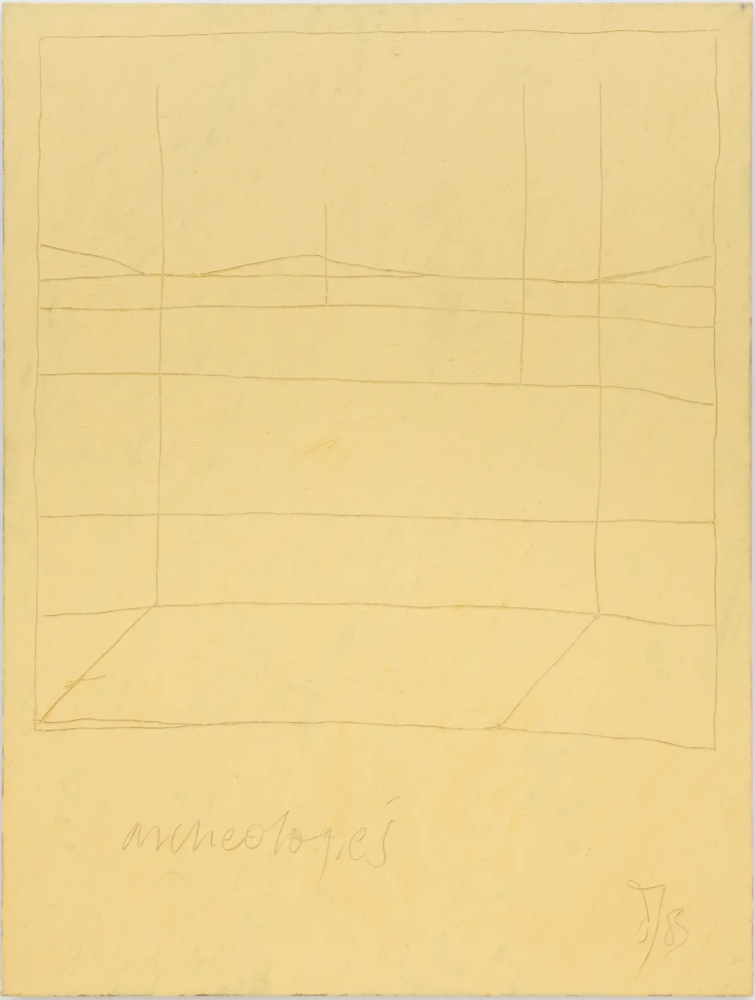

# Model-based archaeology

Over the years, several works have purported the benefits of a model-based archaeology [e.g. @clarke1972; @wylie2002, 91--96], which has especially gained a footing within the sub-field of computational archaeology [e.g. @kohler2007; @lake2015; @barton2013; @gonzalez-perez2018; @romanowska2015; @brughmans2021]. The goal of the next two chapters is two-fold. First to elucidate what defines or can define a model-based scientific approach, and in the next chapter to demonstrate how this can form a useful framework for archaeological inquiry by drawing on examples from the papers of this thesis.

Central to the present chapter are four problem areas in the understanding scientific models, as identified by @frigg2018: 1) The ontological: what are models? 2) The semantic: what do models represent? 3) The epistemological: how do we learn with models? And 4) what consequences do the use of models have for overarching principles such as scientific realism, reductionism and explanation?

One fairly common understanding of models simply entail seeing them as a set of simplifications or assumptions concerning real-world phenomena [e.g. @barton2013, 154]. Any representation could thus be considered a model whether it is generated physically, digitally, verbally, simply imagined, or is construed in a natural or formal language. Scholars arguing the case for model-based archaeology often start out by making the point that whether we acknowledge it or not, we always employ such abstractions when attempting to understand past reality [@kohler2007, 4; @lake2015, 7]. The infinite complexity of reality means that any description of it has to be a simplification, and even if we were able to, a complete rendition of reality would not be a worthwhile endeavour in its own right. A perfect reconstruction of reality would be a tautology, which without perspective offers neither insight nor understanding [@yarrow2006, 77; @slingerland2012, 14--19]. Put differently, whether we understand archaeology as tasked with providing explanation, understanding, or interesting narratives about the past, any demand for a higher empirical resolution, for its own sake, would be a refutation of theory [see @healy2017].

These are, however, universal scientific points, variations of which have been made under diverse headings of archaeological theory [e.g. @johnson2010, 7], and which extends far beyond the scientific endeavour, captured by what the artist Derek Jarman [-@jarman2000, 320, see Figure \@ref(fig:jarman)] described as the \'intellectual imperative of abstraction\'. It would thus follow that if the term model is taken to denote all generalisations or abstractions of reality, which in its ubiquity would include any description or explanation, it is not given why this would have to be dealt with within a comprehensive model-based archaeology. The arguments in favour of a distinct model-based archaeology tend to follow from *how* this necessary simplification should be embraced, and in turn handled. What this entails can be foreshadowed here by invoking the classic quote from @box1979 [2]: 'All models are wrong but some are useful'. But if all models are wrong, what is their epistemic value? To begin to answer this question, the above view of models, simply seeing them as abstractions, will be accepted for now without regard for their demarcation to data, theory and hypotheses.

```{r jarman,  echo = FALSE, out.width = "100%", fig.align = "center", fig.cap = "Derek Jarman, \\textit{Untitled (Yellow Painting - Archeologies)}, 1983. Oil on canvas, 134.6 x 101.6 cm."}

```

## Confronting beliefs with data

Smith [-@smith2015; @smith2017] has stated that one of the most central questions we can ask about our archaeological arguments is 'How would you know if you are wrong?'. Archaeological explanation often take the form of what @binford1981 termed a *post hoc* accommodative argument. This involves first gathering and categorising the data of interest, often using variables chosen by convention and convenience, and then building an explanation around any discerned patterns [@clark2009, 29]. This data-dredging or pattern-searching approach is argued to constitute a limited inferential framework for a couple of reasons.

First, what among the virtually infinite aspects of the material available to us is considered interesting will always be determined by our beliefs concerning the processes that have resulted in their manifestation. What characteristics of the material is recorded and drawn on to organise it will dictate what patterns one can hope to reveal. As @popper1989 [46] framed it, without an underlying theory, how would we know what to look for? If one follows what has been done conventionally, without taking any explicit stance towards this, one will be dependent on how others have conceived of what questions are of interest and how these can be answered. Furthermore, this accommodative process can never falsify our argument, and @smith2015[19] likens it with 'the farmer who paints bulls-eyes around the bullet holes in his barn in order to show his superior shooting skills.' *Post hoc* accommodative arguments can provide the identification of empirical patterns with respects to the employed units of analysis, which in turn can form the basis for social and behavioural hypotheses. But @binford1981 [85] has argued that such arguments can at best be 'treated as provocative ideas in need of evaluation'. @clark2009 [29] states that a necessary next step is to derive empirical implications of this hypothesis, which can be evaluated against a part of the archaeological record that is independent from the material originally used to derive it [also @barton2013]. Subsequent testing thereby provides an opportunity to reveal if one's accommodative belief is wrong.

The explicit testing of archaeological explanations was assertively introduced to the discipline with processualism, which argued that archaeology should adopt the explanatory goals of positivist social sciences. How this was to be done first follows from the standard processual view on what the archaeological material represents. Here, material culture was seen as an integrated part of -- and the result of -- total, multidimensional cultural systems [e.g. @binford1962]. As such, theories concerning how all aspects of cultural systems would influence and manifest in the material record should be conceived. Central to this is that the archaeological material represents an objective, albeit complex empirical record that reflects empirical causes, irrespective of our beliefs about what these causes are. The empirical material will in this processual understanding therefore offer a direct link back to this systemic whole. Archaeological material is representative of the multidimensional causal chain from cultural system to the archaeological record. The goal was therefore to develop theories concerning the prehistoric systemic whole and what processes have influenced the remnants available to us, which were then to be tested by drawing on the hypothetico-deductive approach. Furthermore, drawing on the deductive-nomological or covering-law framework, as taken from the logical positivist/empiricist view of Hempel [e.g. -@hempel1965], the ultimate goal was to establish laws pertaining to the conjunct occurrence of certain types of material remains with certain types of societal systems, irrespective of time and place.

It should be noted here that the programme of logical positivism, and the more mature logical empiricism [although see @uebel2013 on this distinction], were far more nuanced that what they are often given credit for in the archaeological literature concerned with establishing why these views were misguided [@gibbon1989, 8--60]. This is equally true for the over-simplified presentation that is given here. However, this can in part be justified with reference to the naive versions of these programmes that were adopted by positivist social science and archaeology at the time [@gibbon1989, 91--117].

According to @hempel1965 [231--243], the goal of science is to establish laws that are deductively valid, of the kind given by the classic example *All men are mortal / Socrates is a man / Therefore, Socrates is mortal*. If the premises are true, then the conclusion will always be true. However, when adapted to archaeology, the proposed laws were so banal that @flannery1973 stated that attempts at adopting Hempelian empiricism 'has produced some of the worst archaeology on record'. The search for covering laws was therefore quickly abandoned by most practitioners. Furthermore, whether an argument is deductively valid or not is not dependent on whether the premises are true. If it happens to be true that all men are mortal and Socrates is a man, then the deductively valid argument is said to be sound. Determining whether the premises are true of the world depends on non-deductive reasoning. A deductively derived test that successfully corresponds with data only supports the hypothesis inductively, a point that appears to be lost on early processualists [@chapman2016, 27]. However, giving up on the search for covering laws and deductive certainty need not entail that hypothetico-deductive testing is misguided, and more modest goals of confronting beliefs pertaining to specific contexts or research questions with data is, I will argue, still very much a viable goal.

### Confirmation

Within a classic hypothetico-deductive system, an initial goal is to derive as many empirical implications of an explanation as possible. These implications are then to be tested by comparing these implications to actual observed data. Drawing on Carnap's [-@carnap1936, 425] 'gradually increasing confirmation', this entails that each time a model matches the data, the confidence that the model is true is increased. If, on the other hand, the model fails, it can be discarded as untrue. This should thus lead to the continual rejection of false models, and move us ever closer to, but not necessarily to, the actual model of reality. Although certainly an enticing prospect, there are problems related to this approach, irrespective of any goals of establishing covering laws.

A fundamental issue for hypothetico-deductivism, and scientific inference as a whole, follows from Hume's problem of induction [e.g. @ladyman2002, 31--61]. As an empiricist, all knowledge about the world was for Hume derived from sensory perception. Any reasoning that extend beyond observation, past or present, is based on cause and effect. However, since we can never observe a causal connection between events, the conjoined occurrence of observations is all we have to draw on. As there is no logical necessity for regularity in patterns to hold beyond what we can observe, there is no logical foundation for inductive reasoning -- there is no logical connection between the observable and unobservable. While we might observe the sun rise every day, there is no logical contradiction in believing it will not rise tomorrow. Hume held that while inductive reasoning will continue to be fundamental to science, and our every-day lives, it therefore has no logical justification. Following from the problem of induction, an issue for hypothetico-deductivism therefore pertains to the value of testing an hypothesis, and whether with successful tests our belief in the hypothesis should increase.

The logical empiricist attempts at working around the problem of induction and establishing a logical justification for confirmation was never successful, and a move to stating our beliefs in probabilistic terms never dissolved this fundamental issue. Central here is what is known as the paradoxes of confirmation [e.g. @sprenger2023], of which Hempel's [-@hempel1965, 12--20] own raven paradox is a classic example [see  @goodman1983, 59--83 for the so-called new problem of induction]. If the hypothesis is that all ravens are black, this is logically equivalent to the statement that if something is not black it is not a raven. If we were to observe a black raven, this is evidence in support of the hypothesis. The paradox follows from the second statement: Given their logical equivalence, the observation of a green apple would be evidence in support of the hypothesis. Paradoxically then, we can study ravens by looking at apples. While problems of confirmation such as this are simple, they have proven difficult to resolve and a logically sound justification for confirmation is yet to be agreed upon [e.g. @godfrey-smith2003, 39--56].

### Falsification

One of the most influential contentions with the issue of testing is found with Popper and his concept of falsificationism. Popper, also a sceptic of induction, held that the problems of induction cannot be resolved. However, this is not of concern, as science in fact progresses not with confirmation but with falsification. In an attempt at demarcating science from non-science, Popper [e.g. -@popper1989, 33--66] stated that a theory can only be considered scientific if it has the potential to be refuted by observation. A theory that is compatible with all empirical variation is unscientific. The test of an hypothesis should be aimed at falsifying it, not confirming it, and an hypothesis that is not proven false should simply be subjected to even more stringent and elaborate tests. It is with each new rejection of an hypothesis that science progresses and we learn something about the world. Although it will inevitably be falsified, a good theory for Popper is therefore one that is bold, risky and corresponds with the world in surprising ways. There are, however, further issues related to the fundamental prospect of confronting our beliefs with data.

As insight from complex systems theory demonstrates, sensitivity to initial conditions can lead both different causes to produce similar empirical results, and similar causes to produce different empirical results [@vanderleeuw2004, 121; @premo2010]. This reflects the problems of equifinality and underdetermination, as presented in the last chapter, where several explanations can agree on the empirical data, but disagree on the underlying causal mechanisms. This follows from the ubiquity of measuring error and the sensitivity of complex systems to minute variation. One classic example in this regard is the complex system of the weather, which can only be reliably predicted a few days into the future. Human systems are far more complex than that of the weather. Consequently, this renders the prospects of empirical confirmation or falsifiability weakened, and preference among different, even contradictory explanations can often not hope to be based on observable data. In the case of archaeology, explanatory models are additionally faced with our generalisations of an already sparse and fragmented archaeological record, further increasing the likelihood that several explanations account equally well and are underdetermined by the data at hand. However, underdetermination and sensitivity to initial conditions can also impact the assumptions underlying an explanation. To show how this is an issue we can draw on what is known as the Duhem problem [after @duhem1914], or the Duhem-Quine thesis [drawing on @quine1953, and the holistic theory of testing; @psillos1999, 164], which states that nothing is necessarily learned from rejecting an hypothesis on the grounds of a test.

Drawing on @hvidsten2014 [184--187], we may postulate a simple model holding that mechanism A, under assumption B, implies C. In a test in which A occurs, it would in a hypothetico-deductive understanding increase our belief in the model if we could then reliably measure that C is true. In the case of Popper, the model is simply yet to be falsified. If, on the other hand, C is not true, this would imply that either A or B are untrue. We would not, however, be able to derive logically which of A and B are untrue. This would perhaps not appear to be an immediate reason for concern. As long as one aspect of the model is untrue, the model is untrue, and should be rejected. The problem is that we know that models always contain a multitude of untrue assumptions. Drawing on the classic quote from Box above and the earlier discussion on abstraction, all models involve subsuming the virtual infinite complexity of reality and thus cannot work without an equal amount of untrue assumptions that could impact a test [a point made in the context of archaeology by @salmon1975].

In exemplifying the Duhem problem, @ladyman2002 [77--78] gives the example of testing Newtonian gravitational theory by observing the travel of a comet. The theory of gravity alone does not provide a prediction for this path. It also depends on factors such as the mass of the comet, the mass of other objects in the solar system, and their relative positions, velocities and initial positions, as well as Newton's other laws of motion. If the test was to fail, this failure can follow from an untrue hypothesis, but also from a misspecification of an assumption that is subsumed in the test -- such as background conditions, measurement error, and initial conditions of the system. The Duhem-Quine thesis holds that any theory can be saved from refutation by adjusting it's auxiliary assumptions [@psillos1999, 165]. At some level a decision of whether the explanation has in fact been interfaced with observation is therefore needed. As stated by @ladyman2002 [80], 'falsification is only possible in science if there is intersubjective agreement among scientists about what is being tested.' While a severely complicating issue for falsificationism, as Popper also recognised, his proposition still holds if it is qualified by stating that for a hypothesis to be scientific, it has to have the potential to be refuted by some kind of observation. The challenge is determining what kind of observations this is [@godfrey-smith2003, 66].

Drawing on this issue with testing and falsificationism, several authors have argued that these logical inferential schemas do not capture how science has actually progressed. This view can be related to naturalism, which can be conceived of as a perspective where philosophy of science should not be concerned with establishing universal, logically justified formalistic schema for how science should be conducted at remove from the scientific enterprise itself. In a naturalistic view, philosophy of science should rather draw on and be a continuation of scientific ideas themselves [@godfrey-smith2003, 149--162]. While formalistic logic can provide some important insights on what *can* constitute good components of strategies for scientific inquiry, such as aspects of Poppers falsificiationism, the scientific undertaking has been argued to be a far more messy enterprise, where attempts at establishing a universal logical inferential foundation is doomed to fail. As a practical example, the orbit of Mercury was not properly accounted for by Newtonian gravitational theory. While this was known for many years, it was not until Einstein's theory of gravity that this orbit was correctly predicted [@ladyman2002, 89]. Despite being unable to predict the orbit of Mercury, and thus being falsified, this did not cause the abandonment of Newton's theory of gravity.

Examples illustrating this point can easily be found in archaeology as well. For example, when new dates that dramatically push back the earliest human occupation in the Americas have been presented over the years [e.g. @holen2017; @parenti1991; @parenti2018], these have often been met with scepticism as related to their veracity, and geological and other non-anthropogenic alternative explanations have been proposed [e.g. @braje2017; @magnani2019; @agnolin2023]. How convincing an explanation is and what causes it to be abandoned thus clearly depends on more than data alone, not least because data is more than a simple binary category that is either observed/not observed. What data is accepted, what it is understood to represent, and if it is adequately confronted with a hypothesis is in part dependent on a decision by the person who observes and the wider research community. What we observe should to some degree dictate what we believe about the world. However, the examples above demonstrate that stringent empiricism is untenable and is not in fact how scientific insight is achieved.

## Instrumentalism and scientific realism

Arguments such as those presented above have in sum rendered suspect a uni-dimensional absolute demand for adherence with observable data, and presents a significant challenge to the prospect of testing our beliefs about the world. This realisation also underlies common understandings of the virtues of a model-based archaeology, in which a search for the true model of the world should be abandoned. Rather than assessing the correspondence between model and the world, the concern is rather with assessing the degree to which the mechanisms of concern correspond with the world [@kohler2007]. However, if we are to concede to the fact that all models are wrong, how can we ever trust model-based inference?

In a classical instrumental understanding, the goal of science should be the prediction of phenomena that matter [e.g. @hausman1998, 187--190], a view famously forwarded by @friedman1953. Whether prediction is achieved through the use of models that build on true causal mechanisms or not is irrelevant. As long as the predictions of the model has a satisfactory correspondence with the empirical variation of interest, it is deemed a success. This view is therefore compatible with the constraining realisation that all models are wrong, both because the truth of postulated causal mechanisms in and of itself does not matter, and because of the resulting relaxed demand for accordance with total empirical variation -- degree of empirical correspondence determines the choice between models.

Related views have also been advanced within archaeology. The most clear example can be found in the domain of archaeological \'predictive\' modelling, concerned with understanding where archaeological sites are located in the landscape [e.g. @verhagen2012]. These studies have sometimes focused on identifying where sites are located in the present-day landscape, irrespective of past motivations, so as to potentially reduce costs of land-development, or to help guide archaeological surveys in large areas where a complete coverage of the landscape is not possible. The concern then is knowing where sites are and are not located, not why.

However, one of the criticisms forwarded towards instrumentalism is that if the ultimate goal is manipulation of relevant variables for the improvement of society, this will depend on uncovering true causal mechanisms. While mere prediction depends on stable correlation, control necessitates causality [@hausman1998, 190]. As @elster2015 [18] puts it, explanation demands causation, and causation can never be revealed solely through prediction [see also @gibbon1989, 49]. One way to conceive of causality is as dependent on a counter-factual condition [e.g. @lewis1974; @morgan2015, 4--6], simply stated as A causes C if when A occurs then C occurs, and if A does not occur then neither does C. Instrumentalism and a focus on prediction and stable correlation can therefore never hope to explain social phenomena [see also @lake2015, 23--24]. Of course, causal explanation does not necessarily have to be the main concern for archaeology. One could argue that academic interest in causal explanation should not always be the guiding principle behind archaeological inquiry but rather, for example, that mitigating costs associated with land-development or assembling interesting and poetic, albeit more speculative narratives about the past can be more important goals. My view in this context, as stated in the introduction to the thesis, follows from a form of realist understanding, where scientific inquiry is as a strategy by which we try to confront theoretical constructs with empirical observation, aimed at aligning our beliefs as reliably as possible with what is true [@godfrey-smith2003, 161], where the ultimate aim is to answer why something we believe to be true has occurred.

Scientific realism has been the dominating perspective in philosophy of science for decades [@preston2013, 7], and so an enormous range of different realist positions exists [e.g. @psillos1999]. At its core, scientific realism is typically taken to entail the philosophical stance that there exist real observable and unobservable entities and properties, and that claims concerning the veracity of either dimension cannot be set apart [@psillos1999; @gibbon1989, 142--172; @wylie2002, 97--105]. The goal is to reveal these truths, where truth typically follows a commonsensical definition of being determined by what is the case, and not, for example, what we believe to be true or what is most beneficial [@ladyman2002, 157--158; see also @malnes2012, 19--30]. Regardless of whether or not it is possible to ever achieve, the goal of the realist is to reveal true, or approximately true [@psillos1999, 261--279], yet unobservable causal mechanisms that generate and shape the flux of observable phenomena. Scientific realism thus combines causal explanatory goals with ontological theses concerning the existence of observables and unobservables, and epistemological postulates on the possibility of gaining evidence for unobservables [@hausman1998, 191].

In a realist view, even the most careful empirical approach depends on theoretical assumptions that will determine what hypotheses are deemed relevant, what evidence empirical data are believed to represent, and how these are evaluated against hypotheses [@wylie2002, 100]. With the early post-processual critique of processualism, @hodder1984 argued that objective data is never tested against separate independent theories. These theories already underlie and determine how the archaeological material is recorded -- there is no theory-free data. To the realist, however, the realisation that we might view the world differently does not take away from the belief that we inhabit a common reality that exists and is true independently of what we think about it [@godfrey-smith2003, 174]. @shapin1985[355] stated that 'it is ourselves and not reality that is responsible for what we know.', echoed by the archaeologists @shanks1987[111] with the phrase \'there is literally nothing outside of theory\' as archaeologists simply \'create facts\'[@hodder1983, 6; cited by @wylie2015, 6]. This, however, is a false dichotomy. As human knowledge is a part of reality, not something outside of it, it is better to understand human knowledge as the result of both ourselves and the world [@godfrey-smith2003, 132]. By extension, and by drawing on @fodor1984, @godfrey-smith2003 [158--162] states that it is not enough to say that observation is theory-laden. The challenge is determining what theories influence observation, how they do so, and how reality manifests in observation.

As an extension of this view, the form of feminist empiricist perspective advocated by Longino [e.g. -@longino1990] through her 'contextual empiricism' follows from treating the social group as the foundational scientific unit. What constitutes a good explanation in a field of research is determined by the varying views and non-coercive consensus that is reached on these issues at the level of the research community. As we view the world differently, what ideas are brought to bear on an issue, and a decision of whether a theory has been adequately interfaced with data will thus follow from the diversity of that community. Ultimately, this thus extends on aspects of Mill's [-@mill1859] \'marketplace of ideas\' [e.g. @gordon1997] and Feyerabend's [-@feyerabend1970] \'proliferation of ideas\' as scientific virtues [@godfrey-smith2003, 114]. While there is a danger of simplistic generalisations of how for example sex differences influences how one views the world [@longino1990, 187--188], a healthy state for a research community would thus be one where a multiplicity of marginalised and privileged groups are represented. 

<!-- For @longino1990, this does not entail a retreat to relativism, but rather a pragmatic view on objectivity where claims are not [see also @chapman2016, 11]. -->

## What are models?

Building on the above, we can return to the issue of scientific models. While the classic hypothetico-deductive framework in a sense sees every model as a truth-candidate, they are for advocates of a model-based archaeology instead often understood as 'pieces of machinery that relate observations to theoretical ideas' [@clarke1972, 1]. A similar view can be found with Morrison and Morgan's [-@morrison1999] view of 'models as mediators', where a model is a concrete or explicit representation of observables and theoretical beliefs, and allows for a confrontation between these two dimensions. This is very much in line with the model as envisaged by @kohler2007, who sees them as constructions that have similarities with, but exist independently of the target systems that they are to represent. Models are constructions used to draw further inferences about the reality they are to represent, and are construed on the basis of what mechanisms we believe shaped the observables available to us. The hope is that when confronted with the world, the mechanisms of the model that the researcher is interested in correspond with those of the target system. This is how models have often been cast in a realist understanding, and variations on this are sometimes termed credible worlds, or idealised or isolating models (Gilbert 2008; Frigg & Hartmann 2018). These entail the inclusion of boundary conditions or assumptions considered essential for the model to function, the explicit or silent omission of aspects deemed unessential, and can involve an exaggeration of the characteristics of interest [@mäki2009].

To explicate the concept of models as mediators, it can be useful to think in terms of an epistemological hierarchy, extending from observations to high-level theory. In a Mertonian view [@merton1968], this extends from day-to-day working hypothesis of what data represents, to middle-range theories that act as bridging concept for casting these within more comprehensive high-level social theories [@raab1984; @smith2015, 22; see also @lucas2015 for nuances on this]. High-level theories can on this view be understood as \'overall perspectives from which one sees and interprets the world\' [@abend2008, 179], with examples frequently encountered in archaeology being practice theory, cultural evolutionary theory, and so on. Popper was concerned with establishing how Marxism and Freudian psychoanalysis were unscientific, as they are compatible will all empirical variation. However, @godfrey-smith2003[71] holds that attempts at determining whether Marxism is scientific or not is a mistake. Rather, a given instantiation of Marxism -- a Marxist model on the view taken here -- should risk exposure to observation and have the potential to be falsified in a given context. One way to see models is thus as bridging concepts representing concrete instantiations of abstract theories, and as machinery for casting data as evidence to be confronted with these theoretical constructs.

In a realist conception of models, these can thus be seen as analytical tools, the purpose of which is to provide a concrete representation of the researchers beliefs, used to isolate or create a closed and credible surrogate system where causal mechanisms are allowed to work without impediment from surrounding noise [see e.g. @cartwright2009; @mäki2009; @sugden2000; @sugden2009 for discussion and variations on this]. The aim, according to @cartwright2009, is to reveal the capacities and differential contributions of unimpeded causal effects within such an idealised structure. However, this does not mean that the causal contribution is necessarily stable outside the surrogate system. In an open target system, the complex interplay of several causal mechanism can render the contribution from the modelled causal effects completely transformed, compared to their role in an idealised surrogate system [@gibbon1989, 150]. Although stable correlations can point to the possible existence of a causal relationship, the relevance of the realist study of capacities, unlike positivist regularities, does not presuppose closed target systems (Groff 2004:12--16). Positivism can be seen as necessitating a closed system with regular conjunctions between events, such that an event of type A is always followed by an event of type B [@gibbon1989, 149]. @cartwright2009 contends that even though the realist surrogate system is credible, in the sense that the mechanisms could conceivably occur and result in the phenomena in question, the system is almost always different from all real cases in ways that matter. Drawing on the oft-invoked *ceteris paribus* statement -- all other things are in fact not equal (cf. Cartwright 2003[1983]:44--47) -- all models are wrong. The confrontation of model and data can therefore never avoid the problems of induction, and the question of interest then is not whether the model is true or false, but if the model resembles the world in the relevant dimensions, given its purpose [@clarke2007, 747; @kohler2007, 3].

For all the ambiguities nested in the above account of what can be taken to constitute models, a central element is the view that they are constructed and explicit representations of our beliefs. Precisely this is also central to the contention that one of the most important aspect of model-based approaches follow from their explorative side [@hausman1992, 77; @aydinonat2007; @premo2010]. This results both from the assembly process itself, and from subsequent probing and manipulation of the model [@morrison1999]. In the initial construction of a representation of theory and data, the researcher is forced to concretise their assumptions and beliefs. This will likely lead to the adjustment of inconsistencies, the discovery of additional theoretical implications or relevant empirical patterns, and increase the opportunity for explicit handling and reporting of uncertainty. Through stringent and explicit aggregation of model features, further theoretical and empirical consequences are also likely to be revealed. Thus, in its construction, the model will already have provided valuable insights, regardless of its future archaeological life-span. 

Following its construction, further insight can be achieved through direct manipulation of model parameters and assumptions [@morrison1999, 32--35]. This holds the potential of revealing additional causal propensities and limitations that are difficult to reveal by passive study of the model, and can reveal how sensitive it is to such adjustments [@gibbard1978; @premo2010]. It has been argued that the potential of mathematical and computational models to stringently and coherently aggregate a multitude of mechanisms, and allow these to dynamically interact over time means that these can reveal unnoticed or counter-intuitive aggregate effects [@lake2014; @lake2015; @aydinonat2007], in effect generating new evidence that could not be discerned otherwise [@wylie2017]. The same exploratory potential is then extended by any attempts at evaluating the correspondence between model and target system, and by the involvement of an audience that comments, criticises, dismisses or helps align model and target system [@mäki2009].

A further central point for many advocates of a model-based archaeology has been how this. By adjusting a model until it fits the data. the the issues of equifinality and underdetermination informs a view in which emulation of a process that accounts for the empirical variation of interest is not an adequate inferential aim if the goal is to reach true explanations of the past [e.g. @premo2005; @premo2010; @lake2015, 23--24]. As multiple processes could likely account for the empirical patterns under study, mere emulation does not tell us what competing explanations are viable alternatives, and does not provide any basis for evaluating the likelihood that a proposed explanation should have resulted in the observed outcome.

## Inference to the best explanation

So far induction has here been used to denote all non-deductive reasoning, and been exemplified by what is sometimes termed its enumerative or statistical form. That is, induction as the repeated observation of conjoined phenomena. However, other forms of non-deductive inference exist. Archaeology is often, if not most often, concerned with explaining singular or infrequent events, and not generalisations where an appeal to enumerative induction is possible. Clearly then, other lines of reasoning can be drawn on to arrive at and choose between alternative explanations. One such form of inference has been variably labelled abduction, explanatory inference or inference to the best explanation [@godfrey-smith2003, 39--44; @harman1965; @lipton1991]. @lipton1991[58] formulates this mode of inference simply as 'Given our data and background beliefs, we infer what would, if true, provide the best of the competing explanations we can generate of those data.' [@fogelin2007, 604]. Scientific realists often lean on this mode of inference to provide a way around the problems of induction and underdetermination [@psillos1999, 162--182], and this has been argued to constitute a good and often inadvertently employed framework for archaeological inquiry [e.g. @campanaro2021; @fogelin2007].

@fogelin2007 argues that despite the theoretical differences that exists among archaeologists, inference to the best explanation is often the logic underlying their conclusions. For example, he demonstrates how when providing an explanation for smudge pits, a common archaeological feature in Eastern United States, @binford1967 draws on ethnographic analogy to arrive at an explanation that is better than any alternative explanations he can muster [@fogelin2007, 611--612]. Despite using deductive-nomological language, Binford never independently tests any deductively derived hypothesis, and he arrives at his conclusion, @fogelin2007[612] argues, because it is the explanation among the alternatives that corresponds with the widest breadth of relevant empirical data. Similarly, @hodder1991, after having abandoned his most relativistic stance, adopts what he terms a 'guarded objectivity' through an appeal to hermeneutics. This starts with the context of the archaeologists themselves and their pre-existing beliefs and underlying theories, which is opposed to the context of the people responsible for the archaeological material available to us. By moving back and forth between such context and trying to cast our data in the light of these, the goal is to adjust an interpretative whole until the two contexts coalesce. The process is thus one of iteratively fitting empirical pieces within an interpretative whole, that is at the same time adjusted by these pieces. In this framework 'We measure our success in this enmeshing of theory and data (our context and their context) in terms of how much of the data is accounted for by our hypothesis in comparison to other hypotheses.' [@hodder1991, 8]. This is arguably also an appeal to inference to the best explanation [@fogelin2007, 612--614].

Central here is that hypotheses have been argued to be best evaluated when comparing them to the ability of substantive competing alternatives to fulfil the same purpose, and not just their negation, the null-model [e.g. @smith2015; @wylie2002, 95; @perreault2019, 1--22]. Pitching alternatives against each other will lead away from a pure search for corroborative evidence for a single hypothesis, and will, following from Chamberlin's [-@chamberlin1897] 'method of multiple working hypotheses', help the researcher avoid 'a pressing of the theory to make it fit the facts and a pressing of the facts to make them fit the theory' [@chamberlin1897, 843; see also @platt1964; @betts2021]. This thus avoids one of the dangers of *post hoc* accommodative arguments, which has been argued to lead to explanatory complacency and personal attachment to individual explanations [@smith2015; see also @elster2015, 12].

However, if one arrives at hypotheses that account for the data equally well, that is, they are underdetermined, then other criteria will dictate what is the best choice among them. These are often termed theoretical virtues, which when combined is to capture the explanatory power of an hypothesis [@psillos1999, 171]. A first criteria pertains to explanation, where a realist would hold that an hypothesis that makes claims about what has caused an empirical pattern will be given preference over an hypothesis that does not. If a locational model says that sites tend to be located close to rivers, and another explains this with reference to a specific kind of resource exploitation practice, then the second hypothesis would be given preference. Apart from the realist goal of explanation, this follows from the additional empirical implications this causal explanation holds, thus potentially increasing it's explanatory breadth and increasing it's falsifiability. From a Popperian view, it is more risky. Other and interrelated virtues pertains to coherence with established theories, the power of an explanation to unify multiple theories in a unified whole, the consilience of multiple lines of evidence, lack of *ad hoc* explanatory features, and ability to generate novel predictions [@psillos1999, 171]. Simplicity is also often held to be one such theoretical virtue [@fogelin2007; also discussed by @lake2015], although it is not necessarily clear why reality should be simple rather than complex [@godfrey-smith2003; see also @sober2015].

## Evidential scaffolding

Theoretical discussions in archaeology have often framed the field as situated at extremes of positivism and relativism, or humanistic and scientific ideals, harking back to Snow's [-@snow1959] distinction between 'The Two Cultures' in western academia [e.g. @earle1987; @sørensen2017]. However, @chapman2016 and others [see below and @fogelin2007 above] have argued that this perspective does not inform how archaeology has in fact progressed, nor that it constitutes a good reference frame for understanding how to do good archaeology. This is not to say that these discussions cannot hold important points for elucidating the nature of our inferential frameworks, or that theoretical stances do not influence what questions are deemed of interest and how the material record is approached. Rather, this then in a sense naturalistic argument is that these discussions are over-simplified, hyperbole and largely unrepresentative of an archaeology that generally progresses by drawing on a far more complex and eclectic web of theoretical and philosophical influences [see also @hegmon2003; @johnson2006; @pearce2011; @preston2013]. Therefore, the extremes of insisting on trying to establish deductively certain knowledge or a whole-sale rejection of the possibility of ever moving beyond speculation does not represent an adequate reference frame for understanding what constitutes good archaeology, how to conduct it, nor how consensus and synthesis on claims about the past have been arrived at.

Given the realisation that we lack an infallible logical foundation with which to establish explanations, @chapman2016 speak for an iterative epistemological process where a temporary scaffolding for how data is cast as evidence by drawing on multiple methodologies and lines of reasoning is continuously adjusted, extended and reassembled. Crucially, these scaffolds are to be subjected to critical reflexivity, but be grounded in domain-specific norms of what constitutes evidence, so as to tackle what @binford1981 [21] presented as the challenge of 'how to keep our feet on the "empirical" ground and our heads in the "theoretical" sky.' [@chapman2016, 8]. They further draw on @norton2003 to argue that progression in science has been achieved mainly through the domain-specific development of robust reference frames for grounding further inference, not through the development of increasingly sophisticated universal inferential schemas [@chapman2016, 39].

By drawing on @toulmin1958[213], who argues that we should 'abandon the ideal of analytic argument' and the goal of deductive certainty, a central component of Chapman and Wylie's [-@chapman2016, 36--37] argument is illustrated by a quote from @toulmin1958[248]: 

>'The proper course for epistemology is neither to embrace nor to armour oneself against scepticism, but to moderate one's ambitions -- demanding of argument and claims of knowledge in any field not that they should measure up against analytic standards but, more realistically, that they shall achieve whatever sort of cogency or well-foundedness that can relevantly be asked for in that field.' 

Important here is therefore that there is no universal recipe for inferential adequacy, but that inference is domain specific. What we can hope to achieve is that our inferences are credible, but this limitation should not entail a regress into whole-sale scepticism. The goal is to arrive at beliefs that are more reasonable to trust than doubt, without demanding that they should be infallible and beyond critical scrutiny.

Building on the theoretical plurality of archaeology, and echoing the point made by @godfrey-smith2003 referenced above, @chapman2016[41--43] argue that theory-ladenness will differentially impact what archaeologists consider evidence. Some biophysical observations will be relatively transferable between contexts, and their role as archaeological evidence less integrated with theoretical preconceptions. Inferences to do with symbolic behaviour is less transferable as they will be less secure, and more contingent on the given cultural context and the evidential scaffolding supporting them to be considered evidentially adequate. However, this does not mean that symbolic behaviour is in any sense more off-limits than for example chronological inferences that draw on radiometric dating. Neither can reach deductive certainty, and their role as evidence for past events is simply differentially dependent on the warrants and assumptions that underlie them [@chapman2016, 42].

Following @toulmin1958, warrants are here understood as bridging concepts that allows one to move from observed data to explanatory claim.

While the inferential virtues outlined in the section above can constitute some guiding principles for how to arrive at good explanations,  @chapman2016 hold that these cannot be schematically and universally brought to bear on archaeological explanation. Different questions will necessitate different evidence, and different evidence will necessitate different warrants. What Wylie [-@wylie2017; @chapman2016] has held as a central component of evidential scaffolding is that these should be robust and draw on multiple lines of evidence. In his review of @chapman2016, @currie2017 likens this with the view of @cartwright2015 who prefers arguments that are 'short, stocky and tangled' over elegant and tidy arguments that are 'tall and skinny'. That is, at the price of complication, a diverse and broad evidential foundation is more secure than an elegant but fragile chain of evidential premises [see also @bayliss2015; @currie2017a].

## Quantitative archaeology and models

The understanding of archaeological inquiry outlined above need not be cast within a model-based understanding. The term model has been noted to increasingly involve aspects that were previously seen as a domain of theory [@preston2013, 10], and aspects of their role as conceived of here also relate to and cannot necessarily be set apart from other bridging concepts such as hermeneutics, Mertonian middle-range theory and evidential scaffolding. Furthermore, it has also been argued that models are best understood as a separate and distinct kind of reasoning [@godfrey-smith2009] and that models should not be conflated with all kinds of 'representational vehicles'[@godfrey-smith2003, 186--189].

However, despite its ambiguities, I still believe the model term offers a sensible way of thinking about the issues dealt with in thesis. It forces a view where explanations are cast as fallible explicit constructs, which are thus both more easily interrogated by me and others, and are less likely to lead to explanatory complacency. Furthermore, this concretisation and fallibility is also very much compatible with the ideals of open science. Precise and explicit constructs of our beliefs as interrogative machinery lends itself well to a transparent and cumulative research endeavour as these are more readily communicated and disseminated.

Furthermore, this view also directly maps on to developments in statistics, where a model-based framework has increasingly been argued to constitute a better and increasingly more dominating framework than the traditional null-hypothesis significance testing (NHST) approach, which has dominated much of the discipline for the last century or so [e.g. @burnham2002, 1-22; @rodgers2010; @mcelreath2020, 1--17]. To briefly run through this argument, the epistemological basis for NHST starts with assuming a null hypothesis under which chance alone has generated the data, or that there is no meaningful difference between two compared groups. If under some statistical model the observed data is found to be unlikely to be in compliance with this null hypothesis, then the alternative hypothesis, that of the researcher, is favoured. Many authors have pointed to the severe limitations of this approach over the years [e.g. @rozeboom1960; @cohen1994] -- a critique that has gained renewed vigour with the replication crisis that has impacted large swathes of the social sciences [e.g. @nuzzo2014; @wasserstein2016].

Some central issues is that rejecting the null hypothesis does not give logical support to the alternative, nor does failing to reject the null give logical support to the null. Multiple random or neutral processes can be responsible for the data, and data inconsistent with chance can be the result of multiple non-random processes -- a decision concerning the rejection of the null therefore gives limited, if any, explanatory insight. This follows from what is considered the backwards logic of NHST, as it evaluates the probability of the data given the hypothesis, not the probability of the hypothesis given the data. The probability therefore does not concern the veracity of the hypotheses themselves. Additionally, a large enough sample size will always lead to a rejection of the null [@cohen1994]. As @tukey1991 [100] put it 'the effects of A and B are always different -- in some decimal place -- for any A and B. Thus asking "Are the effects of A and B different?" is foolish'. Statistical significance is not equivalent to substantive significance, as the magnitude of the probability associated with a NHST test does not necessarily have any bearing on the size, importance, or lack thereof, of a substantive effect. Furthermore, this kind of dichotomised view of significant/non-significant is argued to often be equated to the truth of an hypothesis, and once a result is reached, subsequent substantive interpretations can quickly extend beyond what the significance test itself warrants [see @crema2022; @timpson2021 on this point in the context of demographic modelling in archaeology].

Some measures to counteract these issues is an increased focus on estimation and fuller reporting of statistical power, effect-sizes and confidence intervals, as well as a focus explicating the processes we believe underlie the data. This is argued to be facilitated by a model-based statistical understanding, an understanding that @rodgers2010[1] argues underlies a \'quiet methodological revolution\' in statistics. He illustrates the concept by example of the arithmetic mean of a distribution [@rodgers2010, 4]. Under the NHTS this is typically denoted a descriptive statistic. In a modelling understanding, the mean can instead be conceived of as one of many possible mathematical models for the data, with the mean being a representation of the central tendency of a distribution. The shift to a model-based perspective leads to the questions of whether this model achieves what the researcher is interested in, and whether it does so better than it's reasonable competitors, which in the case of the mean could be the median [@rodgers2010]. Put differently, the map is never the territory, but an abstract model such as the subway map can prove highly useful for the purposes of commuting, and more useful for commuting than a topographic map [@clarke2007, 742]. Echoing the point made above, we should therefore not evaluate our hypothesis against a null model, it's negation, we should instead cast it against alternative models for fulfilling the same purpose.

The importance of estimation and model evaluation over significance testing has also been promoted in archaeology over the years [e.g. @cowgill1977; @buck1996], and a concern with multi-model inference and model comparison is increasingly evident in the literature [e.g. @eve2014; @dinapoli2021; @timpson2021]. In a similar vein to @rodgers2010, @kohler2007[3] have argued that a drift towards model-based inference has also been quietly happening in archaeology. Furthermore, given the view that the goal is to compare the explanatory power of viable alternatives, not focus on building and corroborating single monolithic explanations, this model-based view is also compatible with Fogelin's [-@fogelin2007] argument that in practice, abduction is the form of reasoning that underlies most archaeological inference, whether this is acknowledged or not.

In closing, the model-based understanding outlined here thus builds on the realisation that data is influenced both by the world and what we believe about it, and that the fallible beliefs we have about the world are built by entire research communities over time. Furthermore, this model-based understanding not only involves the recognition of the necessity of simplification, but is, to repeat @jarman2000[320], to \'embrace the intellectual imperative of abstraction\'. As fallible constructs, the goal is to arrive at a model that is better than any competitors we can muster, not ones that are deductively certain. By extension, a model-based approach is therefore concerned with being transparent and precise in the arguments and assumptions that are being made, and therefore represents a strategy that both helps the modeller clarify their inferential framework to themselves, and facilitates critical engagement by others. Furthermore, as was indicated towards the end of this chapter, casting our questions in this light is also directly compatible with a wealth of techniques in quantitative research more broadly, in which an increasingly model-based understanding recognises and helps handle and make explicit the subjectivity, ambiguity and uncertainty in our proposed explanations [e.g. @flora2018; @mcelreath2020].
