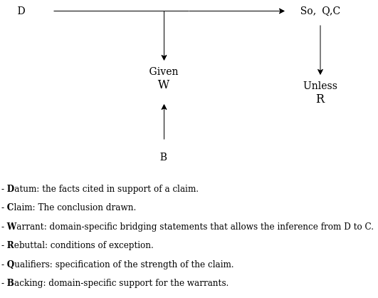
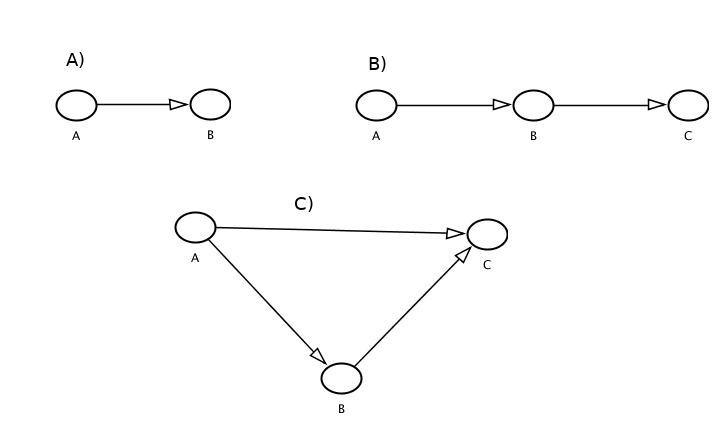
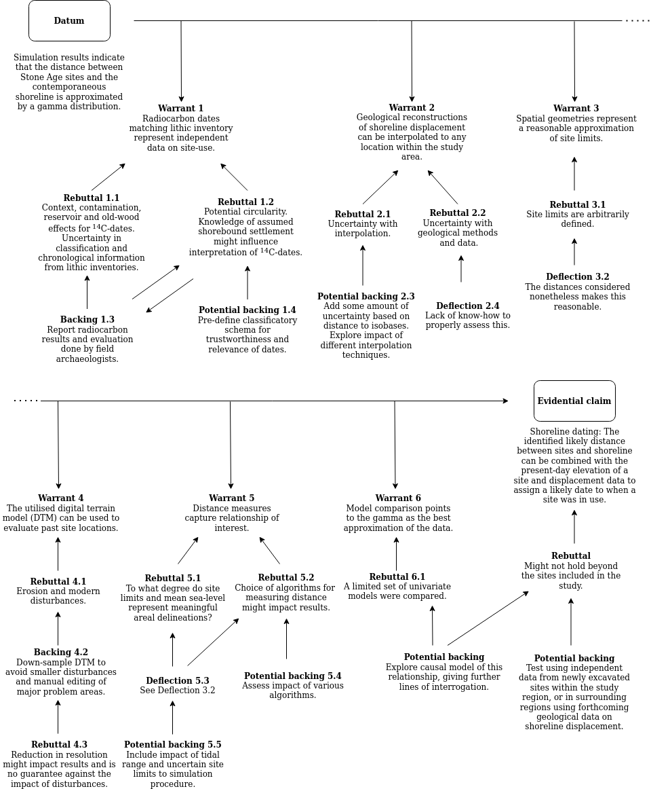
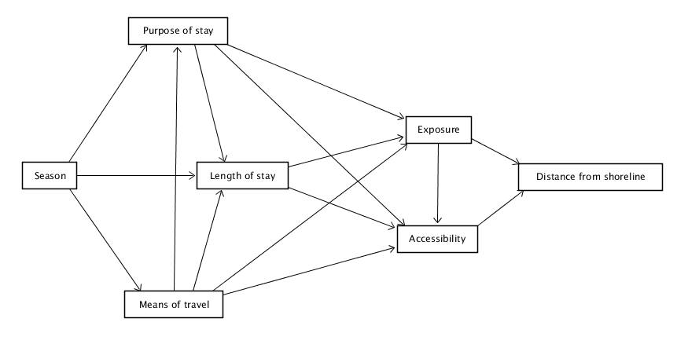

# Modelling the Norwegian Mesolithic

The last chapter laid out the foundation for what can constitute components of a model-based archaeology. This chapter will explore how casting the papers of the thesis in this light can help elucidate assumptions and further lines of inquiry associated with the arguments and empirical patterns identified in the papers. 

First, the evidential foundations and inferential leaps that underlie the archaeological claims made in the papers are explicated by presenting each paper using an evidential argument schema [@chapman2016; @toulmin1958]. Subsequently, a causal model for the main components of each paper is presented in the form of directed acyclic graphs [DAGs, e.g. @morgan2015]. These outline some substantive explanations that I believe might underlie the patterns that are observed in each paper, with the purpose of identifying some implications and avenues along which the results can be further interrogated in the future. First, therefore, the components of evidential argument schemas and graphical causal models are presented.     

## Evidential argument schema

In the following, the presentation of each paper starts with laying out an evidential argument schema for the central evidential claims being made in the papers. The purpose of this is to clarify the argument being made, highlight central and potential objections and uncertainties, ways in which the study account for these, and ways in which this could be further investigated and improved in future studies. The components of the argument schemas are presented in Figure \@ref(fig:argument).


```{r argument,  echo = FALSE, out.width = "100%", fig.align = "center", fig.cap = "Outline of Toulmin's argument schema. The figure is based on Chapman and Wylie (2016:fig.1.1, 33--40) and Toulmin (1958: 94--145)."}

```

Following @toulmin1958, warrants are here understood as bridging concepts that allows one to move from observed data to explanatory claim.

Some adjustments to this framework have been made here. First, I have added the category \'potential backing\'. These are meant to indicate steps that might be taken in future studies to further accommodate rebuttals and to further strengthen the belief that the warrants hold. Secondly, drawing on @chapman2016, the category \'deflection\' indicates cases where I argue that rebuttals can be disregarded either due to an assumed limited impact or due to the challenges involved in properly accounting for them. That is, in these cases the rebuttals are not met with additional backing. Finally, the category \'qualifiers\' from Figure \@ref(fig:dag) is not included, as there were as of yet no grounds on which to properly assess the strength of the evidential claims being made in the papers.   

In the presentation of the papers below, these schemas will not be complete, but draw on what I view as the most central components of the arguments. Further nuances and caveats can be found in prose in the papers themselves, while the data and code published with each paper also offer further sources that can be scrutinised for additional underlying assumptions and potential inconsistencies. 

## Directed acyclic graphs

The second part of the presentation of each paper involves constructing a causal graph that explicate what I believe are the main proximal causal drivers behind the patterns that were observed in each study. This is in part related to the evidential strength of the claims being made because, as was shown in the last chapter, a more holistic explanation and grasp on   

No extensive presentation of causal graphs is given here, and as they are only presented as suggestions that can potentially structure future studies, their full potential is far from being utilised here [see e.g. @morgan2015; @mcelreath2020]. It is nonetheless necessary to establish some terminology. DAGs is a specific kind of causal graph, where the term \'directed\' refers to the rule that causal effects cannot be bi-directional -- that is, causes points to effects. \'Acylic\' refers to the rule that no directed path can form a closed loop. Causal graphs involving cycles and feedback-loops can be accommodated, but @morgan2015[80] recommend focusing on establishing empirically tractable directed graphs in most settings. To illustrate the concept, some basic relationships in a DAG is given in Figure \@ref(fig:dag). 

The direction of the arrows (edges) in the model illustrates what variables (nodes) have an effect on other variables. An arrow going directly between two variables means that there is a direct effect. A is therefore said to have a direct effect on B in Figure \@ref(fig:dag)A. In Figure \@ref(fig:dag)B, the effect of A on C goes through B and is therefore said to be indirect, mediated by B. In Figure \@ref(fig:dag)C B has a direct effect on A, but as A impacts both, A is a confounding variable. That is to say, part of the impact of B on C may simply be the result of A affecting both. 

DAGs are an effective tool for clarifying research questions, for explicating relevant concepts, and to identify assumptions. Furthermore, provided the variables can be sensibly operationalised, DAGs offer a precise statement of how the interrelation between variables should be modelled statistically so as to correctly estimate causal influences while removing effects that confound these estimates.  

```{r dag,  echo = FALSE, out.width = "100%", fig.align = "center", fig.cap = "Examples of central causal relationships represented in directed acyclic graphs. A) Direct effect. B) Indirect effect. C) Confounded effect."}
# dag {
# A [adjusted,pos="-1.203,-0.733"]
# B [adjusted,pos="-1.148,-0.646"]
# C [adjusted,pos="-1.093,-0.729"]
# A -> B
# A -> C
# B -> C
# }


```

## Modelling the relationship between Mesolithic sites and the prehistoric shoreline
\sectionmark{Modelling the Mesolithic site-sea relationship}

In the first paper of this thesis I have proposed a method for shoreline dating Mesolithic sites on the Norwegian Skagerrak coast, based on an empirically derived model of the relationship between the sites and the prehistoric shoreline [@roalkvam2023]. This was based on simulating the distance between sites and the shoreline using 66 ^14^C-dated sites and local reconstructions of shoreline displacement. The ^14^C-dates thus operate as evidence for site-use that is independent of the position of the shoreline at the time, effectively offering a way to test and quantify the long-held belief that coastal Stone Age sites in Norway were located by the shoreline. The study found the sites to typically be located on or close to the shoreline up until some time just after 4000 BCE, when a few sites are located further inland from the shoreline. At around 2500 BCE there is a clear break, and the sites are from this point on situated further from and at variable distances from the shoreline. Building on these findings, the likely elevation of sites dating to earlier than 2500 BCE were, in aggregate, found to be reasonably approximated by the gamma function given in Figure. This is the model that forms the foundation of the proposed method for shoreline dating, which is released as an R package with the second paper of the thesis [@roalkvam2023b].

The evidence and arguments underlying the study are presented as an argument schema in Figure \@ref(fig:t1). This centres on six major warrants that are necessary foundations for the evidential claim to hold. The first of these, Warrant 1, pertains to the radiocarbon dates from the sites and whether these correspond to the typological indicators in the lithic inventory of the sites, or should for some other reasons be disregarded as not being related to the occupation of the sites. For Paper 1, this choice was largely based on following the discretion of the archaeologists who have undertaken the excavations. Excluding these dates substantially increased the degree to which sites were found to have been located by the shoreline, and thus functions in support for the evidential claim. A potential concern could be that the fundamental premise in Norwegian Stone Age archaeology that coastal sites were situated close to the shoreline might have impacted how these dates are treated in the excavation reports. A brief presentation of the dates and the arguments for why they are believed to correspond or not to the use of each site is provided in the supplementary material to the paper (Backing 1.3). While I believe this procedure to be adequate and the interpretations in the excavation reports to generally be sensible, it might be worthwhile improvement to instead predefine a set of evaluation criteria for the quality and relevance of the ^14^C-dates if a similar study was to be undertaken in the future [Potential backing 1.4, following e.g. @seitsonen2012; @pettitt2003]. This would reduce the number of *ad hoc* assessments of the dates.       

A related point that is not included in the schema that is worth commenting on is how several radiocarbon dates from a single site were treated. Dates not intersecting at 99.7% probability were seen as representative of unrelated occupation events. Intersecting dates were then modelled using the OxCal function Boundary, and then summed. However, the procedure of summing dates is argued by some authors to be difficult to justify statistically, and procedures for defining the likely start, span and end-dates for occupational phases might be more sensible. Furthermore, typological indicators in the assemblages could also have been included in the model, thus potentially offering a further backing to Warrant 1.

Warrant 2 pertains to the geological reconstructions of shoreline displacement and the interpolation between these to the sites. This is a necessary premise for it to be possible to evaluate the correspondence between site-use and the sea.   

```{r t1, echo = FALSE, out.width="105%", fig.align="center",  fig.cap="Central evidential arguments underlying Paper 1 and 2, presented as a argument schema drawing on Toulmin (1958) and Chapman and Wylie (2016)."}

```

In one sense this model is instrumental as the *reason* for the location of the sites has not been considered explicitly. By combining the present altitude of a site, its likely elevation above the shoreline when it was in use, and local shoreline displacement curves, this model makes it possible to assign a probabilistic absolute shoreline date to coastal sites in the region. On a realist view, however, it is still true that the treatment of the data and the conception of the model followed from an underlying belief of what mechanisms shaped the patterns in the data deemed relevant. While the model and derived method can be viewed as a instrumental dating tool, they are determined by the proclivity for sites to be located on the shoreline. As such, they are likely to be tightly integrated with both overarching cultural developments, as well as behaviour at the site level. By extension, the multitude of factors that can have shaped the site-sea relationship on the large and small scale, both temporally and spatially, offers a challenging causal web of possible interacting effects that ultimately determine this relationship. Having first derived this largely instrumental model, it gives opportunity to further test its correspondence with other empirical data, and explore and expound underlying theoretical assumptions and implications. 

To illustrate this, below I have constructed a suggestion for a causal model concerning what determines the vertical distance between coastal Mesolithic sites and the shoreline in south-eastern Norway. 

```{r d1, echo = FALSE, fig.align="center", out.width="100%", fig.cap="Suggested causal model for the drivers behind the relationship between site location and the prehistoric shoreline in Mesolithic south-eastern Norway."}

# dag {
# bb="0,0,1,1"
# "Distance from shoreline" [pos="0.557,0.314"]
# "Length of stay" [pos="0.248,0.312"]
# "Means of travel" [pos="0.187,0.496"]
# "Purpose of stay" [pos="0.191,0.105"]
# Accessibility [pos="0.421,0.402"]
# Exposure [pos="0.422,0.246"]
# Season [pos="0.077,0.312"]
# "Length of stay" -> Accessibility
# "Length of stay" -> Exposure
# "Means of travel" -> "Length of stay"
# "Means of travel" -> "Purpose of stay"
# "Means of travel" -> Accessibility
# "Means of travel" -> Exposure
# "Purpose of stay" -> "Length of stay"
# "Purpose of stay" -> Accessibility
# "Purpose of stay" -> Exposure
# Accessibility -> "Distance from shoreline"
# Exposure -> "Distance from shoreline"
# Exposure -> Accessibility
# Season -> "Length of stay"
# Season -> "Means of travel"
# Season -> "Purpose of stay"
# }
```


A likely important factor for how exposed and accessible people accepted a site to be is the purpose of the visit to the site. The purpose of the visit is therefore given a direct effect on exposure and accessibility. For example, is the site meant to be used as a stop to rest and repair tools, to be used as a hunting camp or a location from where to acquire raw-materials for tool-production? Is it a base-camp for the entire residential group from where further forays are made, or is it meant to be a meeting place for several groups? The purpose of the stay is likely also to impact the length of the stay, which in turn might have implications for how close to the shoreline the site is established. A longer stay could for example mean that the site is more withdrawn from the shoreline, so as to make sure storm surges do not reach the site. 

Means of travel is also included in the model. Most travel in the coastal region is assumed to have been done by boat in this period, which means accessibility to the site from the sea is likely to be of concern, as well the ability to safely beach and store the boats. However, some travel was also likely done by foot, for example from a base-camp to a site close by for gathering and processing resources, where the need for the carrying capacity offered by boats might not have been necessary. Travel by sledge on the ice is also a possible alternative. Not having to land boats could presumably have implications for how exposed and accessible a location could be.

The season also presumably has implications for how often one had to establish camp, and possibly reducing mobility in colder periods. The season might also have implications for the kinds of dwelling structures that were necessary to erect, and likely determines the kinds of resources that were exploited, thus potentially impacting the purpose of the stay. The season is also believed to have implications for the degree of wind and wave-action at a location, thus affecting the exposure of the site to the elements, and impacting accessibility. Finally, the season presumably also has implications for the means of travel, for example by enabling the use of sledges in winter-time and reducing the potential use of boats. Season is therefore given a direct effect on all of these variables.

Some variables and nuance that have been left out of the model are worth commenting on. The weather is for example likely to impact a lot of these factors, but is near, if not entirely impossible to determine archaeologically. Furthermore, the purpose of the stay is here indicated using a single variable, but a stay need not, or perhaps likely did not, have a single purpose. A simple example might be a case where multiple kinds of resources were to be exploited from a site. A possible alternative would be to operationalise these as individual variables, where for example the magnitude of seal-hunting and the gathering of hazelnuts to be done from the site is kept as separate variables. These would in turn likely be determined by factors such as the density of these resources in the landscape, their caloric return, their cost in terms of handling-time and -energy, and the potential prestige associated with hunting a specific animal species. 

Furthermore, the entire picture is also further complicated by other latent variables that are left of the model. Social structure, overarching mobility patterns, territoriality, group size and composition, as well as religious beliefs could all impact land-use, site-structure and ultimately how sites were positioned relative to the sea. The proposed causal model thus pertains, as was noted above, to what can be termed proximal causes.  

Nonetheless, I still believe the model forms a reasonable starting point from where to potentially improve the baseline model, and that it has the potential to reveal some important causal determinants for the site-sea relationship. A central challenge is of course how these factors are to be operationalised and determined archaeologically. The exercise of setting up the causal model is still useful in its own right, if not simply by forcing its author to think through and concretise what elements they believe are important and how these are related, but it also forms a framework that dictates how these variables would have to be handled statistically. 

### Operationalising the site-sea model

A central challenge for the proposed model is how the different variables can be measured. For example, determining the season for when a site was in use is possibly an insurmountable challenge, but some avenues for investigation exist. The most immediate line of evidence is drawing on faunal and vegetational material from sites. Depending on what resources were exploited, this could make it possible to discern in what season the sites were in use  [e.g. @bergsvik2011]. Furthermore, @solheim2016 speculated whether what they identified as a predominance of fish on sites located in outer coastal areas, as opposed to terrestrial faunal material at sites in inner coastal areas, could reflect seasonal movement patterns. As bone is typically poorly preserved in the acidic Norwegian soils, this is a challenging line of evidence to draw on, but if this could be shown to consistently correspond to other site features, it could possibly be extended to sites were bone is not preserved. 

Similarly challenging is determining the means of travel. While boats can be reasonably be assumed to have been the main means of transportation throughout the Mesolithic in the coastal region, it has been suggested that sledges and skis could have been used in inland areas [see @sørensen2013]. The relevance of these alternatives has to my knowledge not been extensively explored in the context of coastal Norwegian Mesolithic archaeology. Thus, although the relevance of this variable is therefore not certain, and these suggestions remain speculative, one line of reasoning could be an analysis the topographic location of the site, possibly also combined with insights into resource use and site function.

When it comes to measuring the length of stay, it was suggested in the third paper of this thesis [@roalkvam2022], as presented in more detail below, that aspects of the lithic inventories reflect the duration of stays at the sites under study. Assessing the distance between site and shoreline when accounting for these measures could therefore offer a way forward in this regard. While the length and purpose of the stays are likely to be tightly integrated, the analysis of lithic inventories offer a clear possibility for approaching these issues.

Exposure is one of the variables in the suggested causal models where the
The exposure of Mesolithic sites was investigated in @roalkvam2020 by using viewshed analysis to estimate visibility, and the estimation of wind-fetch to measure exposure to wave-action. A third potential way to handle exposure could be to devise a method for estimating the distance from the site to the outer-most coastal feature at the time the site was in use. Although all of these measures have seen limited or no previous application in Norwegian archaeology, they offer clear ways forward with which to investigate these issues.

Finally, accessibility is another challenging variable to operationalise that has not been explored much in the literature. Good landing places for boats are often pointed to in excavation reports and in the literature, but precisely what this entails is not always as clear. A common feature appears to be a gentle slope towards the prehistoric shoreline, which can readily be explored in a GIS. Furthermore, the exposure of the site location to wave-action is another relevant measure here, and so there does exist potential.

As it stands the most readily implemented explanatory variables of the model is therefore the duration of the stays at the site, their exposure to surrounding landscape, and potentially the accessibility to the sites. The most challenging are those of seasonality and means of travel. To conclude, this exercise has demonstrated the value of suggesting an explicit causal model, and has laid out some potential avenues for further interrogating the issue of the relationship between coastal Mesolithic sites and the contemporaneous shoreline.

## Modelling the technological expediency of Mesolithic assemblages 
\sectionmark{Modelling the expediency of lithic assemblages}

The third paper of this thesis was focused on two analytical avenues. The first of these was using correspondence analysis to evaluate the chronological  development in the occurrence of various artefact categories over time, which in large part appears to coincide with previous suggestions in the literature. The second line of investigation aimed at exploring methods for tracking variation in mobility patterns based on the composition of lithic inventories.

## Modelling demographic developments through the Mesolithic
\sectionmark{Modelling demographic developments}