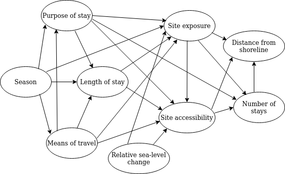

# Modelling the Norwegian Mesolithic

The last chapter laid out the foundation for what can constitute components of a model-based archaeology. This chapter will explore some ways in which casting the papers of the thesis in this light can help elucidate assumptions and further lines of inquiry associated with the arguments and empirical patterns identified in the papers. 

The central empirical patterns and modelling efforts for the papers are presented in Figure \@ref(fig:meso-models). These are presented in simplified form to represent a point of departure for this chapter. A range of ambiguities, nuance and questions concerning the reliability of the results are presented in more details below.  

Figure \@ref(fig:meso-models)A gives the gamma distribution describing the vertical relationship between Mesolithic sites and the contemporaneous shoreline in the study region. This underlies the method for shoreline dating that is proposed in papers 1 and 2. Figure \@ref(fig:meso-models)B presents the variation in what is termed a curation index derived in the third paper. Higher values on this index is suggested to reflect a higher degree of residential mobility. The logistic model in Figure \@ref(fig:meso-models)C describes the temporal frequency distribution of radiocarbon dates within the study area, which is proposed to mainly reflect overall population dynamics. Figure \@ref(fig:meso-models)D presents an exponential model fit to the summed probability of shoreline dates from the study area. The model is rejected, meaning that although it was the best of the explored alternatives, it does not adequately capture this development. Albeit somewhat provisionally, the temporal distribution of shoreline dated sites is suggested to be influenced by population density but be most heavily determined by variation in mobility patterns.    

```{r meso-models,  echo = FALSE, out.width = "100%", fig.align = "center", fig.cap = "Idealised versions of the models derived in the papers of the thesis. Data underlying the models and any uncertainty estimates are left out here. This is with the exception of for D, as this model was rejected as explaining the data. A) The gamma distribution used to describe the likely elevation of sites older than 2500 BCE above the contemporenous sea-level within the study area (Paper 1 and 2). B) The average of 1000 LOESS curves fit to the curation index that characterises lithic inventories within a subsection of the study area (Paper 3). C) Logistic model with maximum likelihood parameters describing the summed probability distribution of radiocarbon dates within the study area (Paper 4). D) The rejected exponential model (red line) describing the summed probability distribution of shoreline dates (black line) within the study area (Paper 4). Deviations from the simulation envelope derived from the exponential model is given a red colour for negative deviation and green for positive.", fig.scap = "Models derived in the papers of the thesis"}

```

In the following, the evidential foundations and inferential leaps that underlie the archaeological claims made in the papers are first explicated by presenting each paper using an evidential argument schema [@chapman2016; @toulmin1958]. Subsequently, a causal model for the main components of each paper is presented in the form of directed acyclic graphs [DAGs, e.g. @morgan2015; @pearl2009]. These outline some substantive explanations that I believe might underlie the patterns that are observed in each paper, with the purpose of identifying some implications and avenues along which the results can be further interrogated in the future. First, therefore, the concepts of evidential argument schemas and graphical causal models are given a brief presention.     

## Evidential argument schema

The presentation of each paper below starts with laying out an evidential argument schema for the central evidential claims being made in the papers. The purpose of this is to clarify the argument being made, highlight central and potential objections and uncertainties, ways in which the study account for these, and ways in which this could be further investigated and improved in future studies. The components of the argument schemas are presented in Figure \@ref(fig:argument).

```{r argument,  echo = FALSE, out.width = "100%", fig.align = "center", fig.cap = "Outline of Toulmin's argument schema. The figure is redrawn from Chapman and Wylie (2016:fig.1.1) which is in turn based on Toulmin (1958:94--145).", fig.scap = "Outline of Toulmin's argument schema"}

```

Following @toulmin1958, \'warrants\' are here understood as bridging concepts that allows one to move from observed data to substantive evidential claim. Warrants are in themselves claims that \'license the inference from facts to conclusions\' [@chapman2016, 34] that therefore also depend on underlying substantive, domain-specific arguments. All claims, including warrants, can in turn be challenged by \'rebuttals\', which represent potential exceptions or objections to the claims being made. To maintain the inferential claim, rebuttals can in turn be answered with additional support and evidence, termed \'backing\'.

Some adjustments to this framework have been made here. First, I have added the category \'potential backing\'. These are meant to indicate steps that might be taken in future studies to further accommodate rebuttals and strengthen the belief that the warrants hold. Secondly, drawing on @chapman2016[176], the category \'deflection\' indicates cases where I argue that rebuttals can be disregarded due to an assumed limited impact and relevance. That is, in these cases the rebuttals are not met with additional backing. Finally, the category \'qualifiers\' from Figure \@ref(fig:dag) is not included, as there were as of yet no grounds on which to properly assess the strength of the evidential claims being made in the papers.   

In the presentation of the papers below, these schemas will not be complete, but draw on what I view as the most central components of the arguments. Further nuances and caveats can be found in prose in the papers themselves, while the data and code published with each paper also offer further sources that can be scrutinised for additional underlying assumptions and potential inconsistencies (see Section \@ref(open)). 

## Directed acyclic graphs

The second part of the presentation of each paper involves constructing a causal graph that explicate what I believe are the main proximal causal drivers behind the patterns that were observed in each study. As was outlined conceptually in Chapter \@ref(chapter4), building comprehensive theories of what we believe underlie a data generating process is central both to meaningfully treat the data, test explanations, and offers a clear path for establishing alternative explanatory frameworks which can be compared and contrasted.

The presentation draws on what has been termed structural causal modelling, which originated with Pearl [see @pearl2009; and @pearl2018 for an accessible introduction], through the use of causal graphs in the form of directed acyclic graphs. While causal graphs in various forms have a long history of use in archaeology [see e.g. contributions in @clarke1972a; and @jorgensen2020c; @price1985a; @kelly2013], the more principled framework of structural causal modelling has seen limited application in the discipline while being increasingly applied in the social sciences more generally [see e.g. @elwert2013; @pearl2009; @mcelreath2020; @morgan2015; @rohrer2018; @huntington-klein2022; @greenland1999]. As the causal graphs presented here are only meant to be cautious suggestions that can potentially structure future studies and accommodate further discussion, their full potential is far from being utilised. 

First, it is necessary to establish some foundational premises and terminology. The goal of structural causal modelling is to allow the associative relationships that can be assessed by use of statistical tools to inform the causal effects that might exist between variables. A blind inclusion of all and as many covariates as one can come up with, without taking an explicit stance towards causation, stands in danger of undermining any drawn conclusions. This follows from the fact that the complete causal web will dictate what variables will have to be controlled for, that is, holding their effect constant either through sampling design or statistical control, and which variables would introduce bias if they are controlled. This is demonstrated through the use of DAGs below.

DAGs represent a specific kind of causal graph, where the term \'directed\' refers to the rule that causal effects cannot be bi-directional -- that is, causes points to effects. \'Acylic\' refers to the rule that no directed path can form a closed loop. To illustrate the concept, a series of basic causal relationships are represented as DAGs in Figure \@ref(fig:dag). While many details have been left of this presentation, all DAGs, irrespective of their complexity, can be constructed and analysed using the basic relationships of chains X &rarr; Y &rarr; Z (and the condensed X &rarr; Y), forks X &larr; Z &rarr; Y, and inverted forks X &rarr; Z &larr; Y [@elwert2013, 249], all which are represented in Figure \@ref(fig:dag). 

The direction of the arrows (edges) in the model illustrates what variables (nodes) have a causal effect on other variables. An arrow going directly between two variables means that there is a direct effect. X is therefore said to have a direct causal effect on Y in Figure \@ref(fig:dag)A. In other words, X causes Y. Treating Y as the dependent response variable and X as the independent explanatory variable in a statistical treatment would in this case be able to provide an estimate of the causal effect of X on Y.  

In Figure \@ref(fig:dag)C, X has a direct effect on Y, but as Z impacts both, Z is a confounding variable. That is to say, part of the impact of X on Y may simply be the result of Z affecting both, thus distorting the causal relationship between X and Y if Z is not controlled for. In Figure \@ref(fig:dag)D, both X and Y cause Z. Z is therefore said to be a collider. Here, controlling for Z would lead to a distortion of the association between between X and Y. This is because conditioning on a common outcome of two variables will introduce spurious association between the variables, known as collider or endogenous selection bias [@elwert2013, 250; see e.g. @griffith2020 for an intuitive example]. In Figure \@ref(fig:dag)B, part of the effect of X on Y goes through Z, which is therefore said to be indirect, mediated by Z. Controlling for Z would in this case block the causal pathway and could lead to an underestimate of the magnitude of the causal effect of X on Y. While there might be situations in which it could be of interest to isolate the effect that remains after accounting for the mediating variable [@baron1986; @hayes2009], it has been demonstrated that this kind of mediation analysis stands in danger of introducing endogenous selection bias [@elwert2013, 264]. A rule of thumb is therefore to not control for mediating variables. 

It might seem disconcerting that DAGs cannot readily accommodate cycles or feedback-loops. While frameworks for directly accommodating this do exist [@white2009], @morgan2015[80] recommend a focus and willingness to first attempt to establish empirically tractable directed graphs in most settings. This follows from the fact that the future cannot cause the past, and so what might appear to represent feedback effects will generally be an issue of temporal resolution [@elwert2013, 249; @greenland1999]. One solution when employing DAGs can thus be to take repeated measures at multiple time-points which can then be added as individual nodes in the model, such that, for example, increasing population density following an initial phase of colonisation might initially lead to a reduction in residential mobility, and reduction in residential mobility could then cause a further increase in population density at a later time-point. Thus, with increased temporal resolution, DAGs can accommodate such complex situations [@rohrer2018, 30]. An inability to establish the time-order of effects, either empirically or theoretically, means that certain causal questions might be out of reach for a fragmented archaeological record of variable quality (see Section \@ref(quality)).

Explicating the causal processes and relationships that we believe underlie our explanations is critical for the construction of study designs and statistical models that correctly account for the causal relationships between variables, as not doing so stands in danger of severely distorting our findings. Provided the variables can be sensibly operationalised, DAGs offer a precise statement of how the interrelation between variables should be modelled statistically or how a sampling design should be structured so as to correctly estimate causal influences while removing the effects of non-causal associations that distort these estimates. Furthermore, causal modelling and the explicit formulation of what mechanisms we believe underlie the data generating process make DAGs an effective tool for clarifying research questions, for explicating relevant concepts, for identifying assumptions underlying an explanation, and for deriving testable implications of an explanation.

It is, however, important to note here that the DAGs presented below are highly speculative and have limited theoretical specification. They are presented in a purely qualitative manner, lacking information about the direction, strength and shape of proposed causal relationships, as well as their operationalisation. Furthermore, as they represent a first iteration, they are only meant to be tenuous suggestions that can potentially pave the way for exploring these issues. This will first involve the challenging task of establishing if and how the variables can be reliably measured, which reflects the fundamental issue of measurement and how archaeological data can be cast as evidence for past events. While the DAGs presented here will undoubtedly be proven to be inadequate in a myriad of ways, I still believe in the benefits of attempting to explicate our suggested explanations in this manner, as they can provide a starting point for further analysis, and for iterative refinement as our understanding grows.

```{r dag,  echo = FALSE, out.width = "100%", fig.align = "center", fig.cap = "Basic patterns of causal relationships represented as directed acyclic graphs. A) Direct effect of X on Y. B) The effect of X on Y is confounded by Z. C) The effect of X and Y collide at Z. D) Part of the effect of X on Y is indirect, mediated through Z.", fig.scap = "Basic patterns of causal relationships represented as directed acyclic graphs"}
# dag {
# A [adjusted,pos="-1.203,-0.733"]
# B [adjusted,pos="-1.148,-0.646"]
# C [adjusted,pos="-1.093,-0.729"]
# A -> B
# A -> C
# B -> C
# }


```

## Modelling the relationship between Mesolithic sites and the prehistoric shoreline {#shoremodel}
\sectionmark{Modelling the site-sea relationship}

In the first paper of this thesis I have proposed a method for shoreline dating Mesolithic sites on the Norwegian Skagerrak coast, based on an empirically derived model of the relationship between the sites and the prehistoric shoreline [@roalkvam2023]. This was based on simulating the distance between sites and the shoreline using 66 ^14^C-dated sites and local reconstructions of shoreline displacement. The ^14^C-dates operate as evidence for site-use that is independent of the position of the shoreline at the time, effectively offering a way to test and quantify the long-held belief that coastal Stone Age sites in Norway were located by the shoreline. The study found the sites to typically be located on or close to the shoreline up until some time just after 4000 BCE, when a few sites are located further inland from the shoreline. At around 2500 BCE there is a clear break, and the sites are from this point on situated further from and at variable distances from the shoreline. Building on these findings, the likely elevation of sites dating to earlier than 2500 BCE were, in aggregate, found to be reasonably approximated by the gamma function given in Figure \@ref(fig:meso-models)A. This is the model that forms the foundation of the proposed method for shoreline dating, which is released as an R package with the second paper of the thesis [@roalkvam2023b].

The evidence and arguments underlying the study are presented as an argument schema in Figure \@ref(fig:t1). This centres on six major warrants that are necessary foundations for the evidential claim to hold. The first of these, Warrant 1, pertains to the radiocarbon dates from the sites and whether these correspond to the typological indicators in the lithic inventory of the sites, or should for some other reasons be disregarded as not being related to the occupation of the sites. For Paper 1, this choice was largely based on following the discretion of the archaeologists who have undertaken the excavations. Excluding the dates viewed as unrelated to the occupation of the sites substantially increased the degree to which sites were found to have been located by the shoreline, and thus functions in support for the evidential claim. A potential concern could be that the close association between coastal sites and the shoreline is fundamental premise in Norwegian Stone Age archaeology, and might therefore have impacted how deviating dates are treated in the excavation reports. A brief presentation of the dates and the arguments for why they are believed to correspond or not to the use of each site is provided in the supplementary material to the paper (Backing 1.3). While I believe this procedure to be adequate and the interpretations in the excavation reports to generally be sensible, it might be a worthwhile improvement to instead predefine a set of evaluation criteria for the quality and relevance of the ^14^C-dates if a similar study was to be undertaken in the future [Potential backing 1.4, following e.g. @pettitt2003; @seitsonen2012]. This would reduce the number of *ad hoc* assessments of the radiocarbon dates.

A related point that is not included in the schema that is worth commenting on is how several radiocarbon dates from a single site were treated. Dates not intersecting at 99.7% probability were seen as representative of unrelated occupation events. Intersecting dates were then modelled using the OxCal [v.4.4, @bronkramsey2021] function Boundary, and then summed using the Sum function. However, the procedure of summing dates is argued by some authors to be difficult to justify statistically, and procedures for defining the likely start, span and end-dates for occupational phases might be more sensible [e.g. @blackwell2003]. Furthermore, typological indicators in the assemblages could also have been explicitly included in the modelling of the dates [e.g @bronkramsey2009; @buck1996], thus potentially offering further backing to Warrant 1.

Warrant 2 pertains to the geological reconstructions of shoreline displacement and the interpolation between these to the sites (the displacement curves are presented in Section \@ref(sealevel)). This is a necessary premise for it to be possible to evaluate the correspondence between site-use and the sea. While it appears that the geological curves can generally be considered trustworthy, there are some uncertainties associated with these that are not accounted for. This follows from the expert knowledge that underlies the compilation of the curves, meaning that some variation between them could simply follow from which experts have conducted the studies. While there exist more principled methodologies for reconstructing relative sea-level change, which could potentially reduce or be used to assess some of this subjectivity [e.g @cahill2016], this was beyond my geological know-how and the scope of this thesis (Deflection 2.4). Furthermore, the procedure for interpolating the trajectory of shoreline displacement to locations between the isobases of the curves was done using inverse distance weighting (IDW). IDW does not account for increased uncertainty as one moves further away from the isobases, and is dependent on how the distance to the isobases is weighed and how many of the isobases are used to inform the interpolation to each location. A host of different interpolation methods exist [e.g. @conolly2020] which, along with the impact of adjusting the parameter settings for the IDW, would be worthwhile to explore (Potential backing 2.3). 

Warrant 3 concerns how the site limits are defined. As was outlined in Section \@ref(modifiable), site limits involves the arbitrary delineation of continuous phenomena represented by the distribution of archaeological artefacts in the landscape. Furthermore, the distribution of artefacts need not represent the entire area making up the activity areas of past inhabitants at a site location. For example the landing area for boats, which presumably has relevance for the location of a site relative to the sea (see also below), can hardly be assumed to be directly reflected in artefact distributions. Deflection 3.2 states that while all of these are valid points, I believe the distances considered means that these dimensions will have limited influence on the final results. 

Warrant 4 pertains to the digital terrain model (DTM) that is used when adjusting the sea-level to its position in the Mesolithic. While erosion and modern disturbances has impacted the DTM, this was attempted to be accounted for by using a 10 m resolution DTM that is a down-sampled version of the 1 m version provided by the Norwegian Mapping Authority [@mapping2018], and by manually defining and interpolating the elevation values over especially problematic areas such highways and quarries. While I believe this to have been largely successful, this cannot be guaranteed (Rebuttal 4.3). However, if there are individual cases were this is not true, I believe the overall results to still hold. The future inclusion of larger sample could also be a way to mitigate such problems.

Warrant 5 states that for the modelling efforts to hold, the precise details for how the distance between site and shoreline was measured is a central component. This pertains both to how the shoreline and the site limits (see Warrant 3) are defined (Rebuttal 5.1), and what methods were used for the measuring of the distances (Rebuttal 5.2). Central aspects here is that the displacement curves used to define the position of the shoreline represent the mean sea-level. For the definition of the site limits, Deflection 3.2 from above is relevant also here, while Potential backing 5.5 suggests that both including an estimate of the tidal range and potentially exploring the definition and uncertainty associated with the delineation of the site limits could be worked into the simulation procedure. 

When it comes to the measured distances, the main measure, which also underlies the proposed method for shoreline dating, is the vertical distance between the elevation of the shoreline and the lowest point on the site polygons. In addition to this, measures for the distance between the horizontally closest points on the site and the shoreline, as well as the topographic distance (that is, the distance when accounting for the slope of the terrain) between the sites and the horizontally closest points were also taken. Especially the last measure entails some simplification. Measuring the topographic distance to the horizontally closest points means that this does not necessarily identify the topographically closest points, which is a more computationally expensive operation. Furthermore, identifying the topographically shortest path between these points is also dependent on the choice of least cost path algorithm [e.g. @herzog2013]. Again, however, I believe that the distances considered means that the assumptions and inferential leaps that this warrant requires will have a limited impact on the findings (Deflection 5.3).

```{r t1, echo = FALSE, out.height = "105%", out.width = "105%", fig.align="center",  fig.cap="Argument schema for Paper 1 and 2."}

```

The last warrant, Warrant 6, pertains to the treatment of the data following the simulations. This was done by fitting an array of standard models to the univariate distribution of vertical elevation distances between sites and shoreline, and selecting the gamma as the best model by use of the Akaike information criterion (AIC) and Bayesian information criterion (BIC). Given the fairly limited consideration of competing univariate models and the lack of probability estimates for the model parameters, the study can ultimately be considered part of a procedure of modular model construction, where this study represents a first step [e.g. @buck1996; @gelman2020].

Finally, the study does not involve any consideration of what factors have caused the distribution of elevation values, which is also reflected by the use of univariate models. In one way this can therefore be viewed as an instrumental model as the *reason* for the location of the sites has not been considered explicitly. The concern is directed towards prediction not explanation. By combining the present altitude of a site, its likely elevation above the shoreline when it was in use, as informed by the gamma function, and local shoreline displacement curves, this model makes it possible to assign a probabilistic absolute shoreline date to coastal sites in the region. While the model and derived method can be viewed as a instrumental dating tool, it is determined by the proclivity for sites to be located on the shoreline. As such, it likely to be tightly integrated with both overarching cultural developments, as well as behaviour at the site level. By extension, the multitude of factors that can have shaped the site-sea relationship on the large and small scale, both temporally and spatially, offers a challenging causal web of possible interacting effects. Having first derived this instrumental model, however, this gives opportunity both to further test its correspondence with other empirical data, and explore and expound underlying theoretical assumptions and implications. To this end, I have constructed a suggestion for a causal model concerning what could be the determining factors for the vertical distance between coastal Mesolithic sites and the shoreline in south-eastern Norway (Figure \@ref(fig:d1)). 

### Causal model for the site-sea relationship

```{r d1, echo = FALSE, fig.align="center", out.width="100%", fig.cap="Suggested causal model for the drivers behind the relationship between site location and the prehistoric shoreline in Mesolithic south-eastern Norway.", fig.scap = "Causal model for the site-sea relationship"}

```

An immediately obvious aspect of the suggested model is that the effect of all variables for the the site-sea relationship is mediated through the variables site exposure, pertaining to the exposure of the location to wind and wave action; site accessibility, concerning access to and from the site; and the number of stays at the site. Consequently, these also represent some of the strongest causal assumptions in the model, as the presence of arrows in causal graphs merely point to a possible causal relationship. The strongest claims of knowledge in a causal graph rather stems from missing arrows [@elwert2013]. Removing arrows can be based on either theory or data, meaning that some of the suggested relationships in the DAG could be proven to be of little to no relevance in future empirical studies or theoretical discussions. 

A likely important factor for how exposed and accessible people accepted a site location to be is the purpose of the visit to the site. The purpose of the visit is therefore given a direct effect on exposure and accessibility. For example, is the site meant to be used as a stop to rest and repair tools, to be used as a hunting camp or a location from where to acquire raw materials for tool-production? Is it a base-camp for the entire residential group from where further forays are made, or is it meant to be a meeting place for several groups? 

The purpose of the stay is likely also to impact the length of the stay, which in turn might have implications for how close to the shoreline the site is established. A longer stay could for example mean that the site would have to be more withdrawn from the shoreline, so as to make sure storm surges do not reach the site. The length of stay is not given a direct effect on the distance to the shoreline, as sites in the region are interpreted to not having been in used for more than, at most, a few months at a time [e.g @glorstad2010]. This means that the shoreline regression would have been negligible within the time-span of any individual stay.

Means of travel is also included in the model. Most travel in the coastal region is assumed to have been done by boat in this period, which means accessibility to the site from the sea is likely to be of concern, as well the ability to safely beach and store the boats. However, what kind of boats that were in use does remain a point of discussion [see e.g. @glorstad2013 with comments; @schmitt2013], and could have implications for these dimensions. Furthermore, some travel was also likely done by foot [see e.g. @bjerck2016; @petterson2018; @schulke2023]. This could for example be from a base-camp to a site close by for gathering and processing resources, where the need for the carrying capacity offered by boats might not have been necessary. Travel by foot is also an alternative, as well as by skis or sledge in the winter-timer, for example in connection with the hunting and processing of resting seal that are not disturbed by approaching people, or species of seal that predictably utilise breathing holes in the ice [see @bjerck2016]. Not having to land boats could presumably have implications for the degree and in what ways a site location could be exposed and accessible.

The season could also have implications for how often one had to establish camp, and possibly led to a reduction of mobility in colder periods [cf. @binford1990]. The season might also influence the kinds of dwelling structures that were necessary to erect, and likely determines the kinds of resources that were exploited, thus potentially impacting the purpose of the stay. The season is also believed to have implications for the degree of wind and wave-action at a location, thus affecting the exposure of the site to the elements, and impacting accessibility. Finally, the season presumably also has implications for the means of travel, for example by reducing the potential use of boats and enabling travel on the ice. Season is therefore given a direct effect on all of these variables.

The full period of time over which a site was is in use could presumably be influenced by relative sea-level change by the determining the frequency of revisits. Depending in part on the topography, relative sea-level change could make a location increasingly less attractive due to a reduced accessibility to and from the site or by impacting its exposure. In periods characterised by more a stable sea-level, on the other hand, a single location would have retained any strategic or beneficial position over a longer time-span, allowing for repeated visits over a longer period. Relative sea-level change is therefore given an indirect effect on the distance to the shoreline, mediated by accessibility, exposure and number of stays. However, these are presumably not the only factors determining the number of times a place could be revisited. Following for example from an investment into more substantial dwelling structures or due to some other factors that might elevate its importance [see e.g. @glorstad2010, 97--102; @schulke2020], it would seem plausible that such factors could counterbalance, to a degree, the adverse effects of relative sea-level change on the attractiveness of a site location. This is indicated by the the direct effect of purpose of visits on number of visits.

Some variables and nuance that have been left out of the model are worth commenting on. The weather is for example likely to impact many of these factors, but is near, if not entirely impossible to determine archaeologically. Furthermore, the purpose of a stay is here indicated using a single variable, but a stay need not, or perhaps likely did not, have a single purpose. A simple example might be a case where multiple kinds of resources were to be exploited from a site. A possible alternative would be to operationalise these as individual variables, where for example the magnitude of seal-hunting and the gathering of hazelnuts to be done from the site is kept as separate variables. These would in turn likely be determined by factors such as the density of these resources in the landscape, their caloric return, their cost in terms of handling-time and -energy, and the potential prestige associated with hunting a specific animal species or sharing resources [see e.g. @kelly2013]. 

Furthermore, the entire picture is also further complicated by other latent variables that are left of the model. Social structure, overarching mobility patterns, territoriality, group size and composition, as well as religious beliefs could all impact land-use, site-structure and ultimately how sites were positioned relative to the sea. The proposed causal model thus pertains, as was noted above, to what can be termed proximal causes.  

Nonetheless, I still believe the model forms a reasonable starting point from where to potentially improve the baseline model, and that it has the potential to reveal some important causal determinants for the site-sea relationship. A central challenge is of course how these factors are to be operationalised and determined archaeologically. The exercise of setting up the causal model is still useful in its own right, if not simply by forcing its author to think through and concretise what elements they believe are important and how these are related, but it also forms a framework that dictates how these variables would have to be handled analytically. 

A central challenge for the proposed model is thus how the different variables can be measured. For example, determining the season for when a site was in use is possibly an insurmountable challenge in many cases, but some avenues for investigation exist. The most immediate line of evidence is drawing on faunal and vegetational material. Depending on what resources were exploited, this could make it possible to discern in what season the sites were in use  [e.g. @boethius2020; @mikkelsen1978]. Furthermore, @solheim2016 speculated whether what they identified as a predominance of fish remains on sites located in outer coastal areas, as opposed to terrestrial faunal material at sites in inner coastal areas, could reflect seasonal movement patterns [see also @bergsvik2020]. As bone is typically poorly preserved in the acidic Norwegian soils, this is a challenging line of evidence to draw on, but if this could be shown to consistently correspond to other site features such as their location, this could possibly be extended to sites where bone is not preserved. 

Similarly challenging is determining the means of travel. While boats can be reasonably be assumed to have been the main means of transportation throughout the Mesolithic in the coastal region, some controversy surrounds what kinds of boats were in use [e.g. @glorstad2013, with comments], and it has been suggested that sledges and skis could have been used in inland areas [see @sørensen2013]. Although the relevance of this variable is therefore not certain, and these suggestions remain speculative, one line of reasoning could be to examine he topographic location of the site.

When it comes to measuring the length of stay, it was suggested in the third paper of this thesis [@roalkvam2022], as presented in more detail below, that aspects of the lithic inventories reflect the duration of stays at the sites under study. Assessing the distance between site and shoreline when accounting for these measures could therefore offer a way forward in this regard. While the length and purpose of the stays are likely to be tightly integrated, the analysis of lithic inventories offer a clear possibility for approaching these issues.

Exposure is one of the variables in the suggested causal models where a range of analytical avenues exist. The exposure of Mesolithic sites was investigated in @roalkvam2020 by using viewshed analysis to estimate visibility, and the estimation of wind-fetch to measure exposure to wave-action. A third potential way to handle exposure could be to devise a method for estimating the distance from the site to the outer-most coastal feature at the time the site was in use. Although all of these measures have seen limited or no previous application in Norwegian archaeology, they offer clear ways forward with which to investigate these issues.

Accessibility is another challenging variable to operationalise that has not been explored much in the literature. Good landing places for boats are often pointed to in excavation reports and in the literature. Common defining features of this appears to be a gentle slope towards the prehistoric shoreline, which can readily be explored in a geographical information system, as well as the degree to which the surroundings of a site forms a natural harbour by being less exposed to winds and wave-action [e.g. @bjerck1990; @nummedal1923; @petterson2018]. Drawing on the methods suggested for estimating the exposure a site, its accessibility could therefore also conceivably be measured. 

While multiple occupational phases as suggested by ^14^C-dates were included in the analysis for Paper 3, the number of stays at the sites was not treated explicitly when deriving the method for shoreline dating. Both radiocarbon dates and lithic inventories can provide information on the number of visits [e.g. @åstveit2023], and a possible approach could be to treat the measure of distances from site to shoreline for each inferred phase of occupation individually in subsequent quantitative analysis. 

Finally, the rate of relative sea-level change, which is assumed to be of relevance to the number of stays, can be readily derived from the employed geological displacement curves.

As it stands the most readily operationalised explanatory variables of the model is therefore the duration of the stays at the site, their exposure to surrounding landscape, the rate of relative sea-level change in the period of use -- and potentially the accessibility to the sites and the number of occupational phases. To conclude, this exercise has demonstrated some of the value of suggesting an explicit causal model, and has laid out some potential avenues for further interrogating the issue of the relationship between coastal Mesolithic sites and the contemporaneous shoreline.

## Modelling the technological expediency of Mesolithic assemblages 
\sectionmark{Modelling the expediency of lithic assemblages}

The third paper of this thesis [@roalkvam2022] was aimed at exploring methods for handling lithic assemblages associated with the large number of excavated Mesolithic sites in the region, which can range in size from a few hundred to several thousands artefacts. The 55 sites chosen for analysis were excavated as part of four large excavation projects undertaken by the Museum of Cultural History in the last two decades, and were located within a constrained geographical area. This means that the excavations were carried out using similar excavation methods and that the classification of the artefact inventories followed similar guidelines. This choice of sample was aimed at reducing the amount of variation in the assemblages that could follow simply from investigatory and classificatory differences, as well as from variable access to raw materials when they were in use. The analysis focused on two analytical avenues. The first of these was to evaluate the chronological development in the occurrence of artefact categories over time, which in large part appears to coincide with previous suggestions in the literature. The second line of investigation was aimed at exploring methods for tracking variation in mobility patterns based on the composition of lithic inventories, which is the part of the analysis that is in focus here.

In terms of chronological fixing of the occupation of the sites, this was based either on radiocarbon dates or shoreline dates in combination with typological indicators. This study was undertaken before Paper 1 and 2 the newly proposed method for shoreline dating had therefore not yet been developed. This means that the dates informed by shoreline displacement and typological indicators were accepted as they are given in the original excavation reports. In addition to this, only radiocarbon dates seen as relevant for the occupation of the sites in the reports were considered.

The evidential claim of the paper is that the forager--collector continuum, as outlined in Section \@ref(mobility), is captured by variables taken from the Whole Assemblage Behavioural Indicators [WABI, see @clark2017]. This involves the assumption that the abundance of available resources and knowledge of their sources impacts the degree of retouch in the assemblages, where retouch is taken to represent efforts to extend the use-life of lithics by rejuvenating edges and re-purposing tools. Following this logic, higher mobility will lead to a greater necessity to conserve lithics in anticipation of more uncertain and less predictable circumstances. Lower degree of mobility, on the other hand, should affect the organisation of lithic technology by leading to more predictable surroundings, distribution of resources and what tasks that have to be performed. This leads to reduced necessity for conservation and re-purposing of lithics. The different forms of technological organisation that is to result from these situations is denoted by the terms curation and expedience, which, following from their dependence on on mobility patterns, are to reflect the forager--collector continuum. The central empirical correlates of technological curation is high degrees of retouch and low overall density of lithics, with the reverse being defining for technological expediency. 

The analysis undertaken for the paper was exploratory, meaning that a range of variables in the assemblages that have previously been associated with mobility patterns were included in a principal components analysis to assess their ability to explain the variation in the data. The findings confirmed that the proportion of non-flint material in the assemblages increases through the Mesoltihic, as has been noted by numerous authors over the years [e.g. @reitan2022; @solheim2017c], and which has been argued to be an indication of decrease in residential mobility through the Mesolithic of south-eastern Norway [@glorstad2010, 181; @jaksland2001, 112]. Furthermore, this development conforms with the expectations of the WABI by showing an overall decrease in the proportion of secondarily worked lithics and an increase in the volumetric density of lithics on the sites over time.

To further explore the nature of this development, while also accounting for the temporal uncertainty associated with the dating of the sites, the two WABI variables were combined into a 'curation index'. This was done by min-max normalisation, adjusting the variables to take on values between 0 and 1. The volumetric density of lithics was then made negative, as higher values is to indicate a lower degree of curation, and the mean was then taken for the two variables for each site to find their value on the curation index. A simulation was then performed to account for the temporal uncertainty associated with the developments in this curation index over time. For each simulation run, the date of a site was drawn from their associated date ranges, either uniformly in the case where the site were dated by reference to shoreline displacement and typology, or, where these were available, by drawing the year weighted by the sum of the posterior density estimates of radiocarbon dates. For each simulation run, a locally estimated scatterplot smoothing (LOESS) curve was fit to the data to capture the overall developments in the curation index. The average LOESS curve from 1000 simulation runs is given in Figure \@ref(fig:meso-models)B.

```{r t3, echo = FALSE, out.height = "105%", out.width = "105%", fig.align="center",  fig.cap="Argument schema for Paper 3."}

```

The necessary warrants underlying the study are presented in the argument schema in Figure \@ref(fig:t3). The first warrant pertains to the issue of whether the artefact inventories have been consistently categorised across excavation reports. The support for this can initially be found in the sample of sites that was chosen for the study, which was aimed at being likely to have artefact inventories that were categorised using similar methods. To add to this, the key variables of the WABI, namely proportion of secondarily worked lithics and volumetric density of lithics, are both variables that have had the same definition for decades [cf. @helskog1976]. Consequently, while the sample itself makes this rebuttal likely to be of less concern, part of the value of the WABI is that these variables lend themselves well to studies of legacy data where more modern classificatory schemas have not been used [Backing 1.3; ]. However, some ancillary expectation of the WABI were not found to correspond to the suggested developments. This especially pertains to the role of cores. One expectation of the WABI is that un-exhausted cores is likely to be more frequent in assemblages characterised by a lower degree of mobility, but no clear chronological patterning could be identified in the frequency of cores in the assemblages. However, this could be related to the fact that these are often not classified beyond being categorised as cores, and so a more in-depth analysis might reveal different patterns related to dimensions such as the exhaustion of the cores. While the analysis of cores need not employ this methodology, this point can be related to Potential backing 1.4 in the argument schema, where a more principled analysis of the artefact inventories by the use of geometric morphometric is suggested [see e.g. @matzig2021; @shott2010].

Warrant 2 concerns the chronological control for the accumulation of the lithic assemblages. 17 of the 55 sites were associated with radiocarbon dates which were seen as relevant to the occupation of the sites in the original reports. Multiple dates from a single site were then treated by use of the Boundary and Sum functions in OxCal, and so the same points as those discussed for radiocarbon dates in relation to Paper 1 in Section \@ref(shoremodel) are also relevant here. More critical is the fact that as Paper 3 was written before Paper 1 and 2, the newly developed method for shoreline dating was not applied. Instead, the shoreline dates were taken directly from the reports. In Paper 1 I found that previous applications of shoreline dating generally corresponded with the start dates of the ones achieved with the newly proposed method, but previous application have tended to overestimate the precision of the dates [@roalkvam2023, 11--15]. This can in part follow from the fact that the excavation reports also draw on typological information and not only shoreline dating, thus constraining the achieved date. However, this has always been done in an informal manner and so it is difficult to assess the degree to which the precision achieved in the reports can be justified (Rebuttal 2.1). The chronological control could therefore be somewhat exaggerated for Paper 3, and a clear point of improvement would be to undertake the study using the new method for shoreline dating (Potential backing 2.3).

Warrant 3 and 4 can be treated in unison here, as they concern whether the curated--expedient continuum is meaningfully captured by the variables of the WABI, and whether this in turn reflects the forager--collector continuum as originally devised by @binford1980. As is indicated by the title of the paper *Exploring the composition of lithic assemblages in Mesolithic south-eastern Norway*, the paper is explicitly exploratory. This means that it was aimed at identifying empirical patterns and suggest some potential explanations for their occurrence. The study thus decidedly entailed *post hoc* accommodative argumentation (see Section \@ref(confronting)), as the explanations were construed following the identification of the empirical patterns. These patterns correspond to those that could be expected from the main components of the WABI, with previous suggestions for the development of mobility patterns through the Mesolithic of south-eastern Norway, and with the corresponding increased use of non-flint material through the period (Backing 4.1). The relevance of the WABI for tracking mobility patterns based on lithic assemblages has been explored and substantiated over a range of different contexts in Eurasia -- ranging in temporal coverage from the Pleistocene to the Holocene, and by drawing on assemblages associated with both Neanderthals and anatomically modern humans [e.g. @barton2013a; @clark2017; @barton2018; @riel-salvatore2008]. 

However, as a first attempt at employing these measures in the context of Mesolithic Scandinavia, and, as was noted in Section \@ref(mobility), following from the coastal setting that might have implications for the applicability of the collector--forager continuum, both the reliability of Warrant 3 and 4, and, by extension, the the main evidential claim of the paper should be explored and tested in a range of ways (Rebuttal 3.1 and 4.1). First, given the explorative and accommodative analytical framework, additional testing of the framework using independent data would be fruitful both to assess the strength of the evidential claim, and has the potential to reveal nuances that were not captured in the study undertaken for Paper 3. Furthermore, given the developments in mobility patterns that this framework is believed to capture, drawing on other variables that are believed to be related to these developments should also be explored. A fruitful first step to achieve this is to set up a causal model, a suggestion for which is presented in Figure \@ref(fig:d3).    

### Causal model for the expediency of lithic assemblages 

The causal model that underlies the relationship between lithic inventories and residential mobility is fairly straightforward in that it posits that higher residential mobility leads to a higher degree of expedient technological organisation. This follows indirectly from the assumption that a reduction in mobility leads to a better predictability of raw material availability and allows for its accumulation if sites are occupied for a longer duration. With increased occupational duration, the tasks that will have to be carried out are also believed to more predictable than in a situation of high mobility, where changing and more unpredictable circumstances will lead to a more curated technology. In the model, residential mobility is therefore given a direct effect on all the variables underlying the curated--expedient continuum. This relationship is effectively an instantiation of that which has been proposed by Barton and collegues in other context [e.g. @clark2017; @barton2014], where properties of the lithic assemblage functions as indicator variables for the underlying causal drivers.  

An addition to the model that is more specific to the Norwegian Mesolithic follows from the role of non-flint material. It was found in Paper 3 that an increase in the use of non-flint material occurs over time. As mentioned above, it has previously been suggested that this reflects an increased familiarity with local surroundings, and that this is related to a decrease of residential mobility. In the paper it was found that the overall development in the curation index was robust to removing non-flint material from the data set, but this procedure did markedly increase the curation values for some individual sites. The effect of non-flint material can therefore potentially be more marked in other contexts.  

An important assumption concerning the role of non-flint material in the suggested causal model is that there is no direct effect between choice of raw material and technological expediency. The assumption is thus that raw material only impacts the empirical indicator variables for technological expediency without directly impacting the fundamental technological strategy itself. However, it is possibly premature to remove this arrow of effect, as it is a proposition that would benefit from further substantiation, including an assessment of the degree to which choice of material might impact raw material predictability. Furthermore, excavations in areas such as Aust-Agder, located south of the study area of Paper 3, have found that quartz is often a more dominating part of the assemblages in this region [e.g. @reitan2018c]. Thus, while the overall developments were robust to the effect of excluding non-flint material for the sample of assemblages considered for Paper 3, it is not clear that this relationship necessarily holds in areas with a different availability of various raw materials. Consequently, the question of the spatial stationarity of the relationship between non-flint material and expediency is relevant, irrespective of whether this is thought to be of direct causal relevance for technological organisation or for the adjustment of its indicator variables. 

Finally, while the sample of sites chosen for Paper 3 was aimed at reducing the confounding effects of investigatory and classificatory differences that might exist between excavations, it is possible that with an extension of the study to include a larger sample, nodes representing such effects should be included in the causal model.

In the exploratory setting of Paper 3, the relevance of the WABI was mainly arrived at based on their correspondence with overall developments in mobility patterns and use of non-flint material that has previously been proposed in the literature. However, a proper evaluation of the causal model presented in Figure \@ref(fig:d3), and a clarification of the potential role of the curated--expedient continuum for tracking mobility patterns will depend on comparing it with other, properly operationalised variables that have been suggested to be of relevance to the same developments. One way forward in this regard is represented by the the findings of the fourth paper of this thesis.

```{r d3, echo = FALSE, fig.align="center", out.width="100%", fig.cap="Suggested causal model for the drivers behind the relationship between mobility patterns and the composition of lithic inventories.", fig.scap = "Causal model for the expediency of lithic assemblages"}

```

## Modelling demographic developments through the Mesolithic
\sectionmark{Modelling demographic developments}

The fourth and final paper of the thesis, written in collaboration with Steinar Solheim, contrasts two proxies that have often been drawn on to model relative population density in Fennoscandia, namely radiocarbon and shoreline dates [e.g. @solheim2018; @tallavaara2020]. These are analysed by way of summed probability distribution of radiocarbon dates (RSPD), and, drawing on Paper 1 and 2, the summed probability distribution of shoreline dates (SSPD) from within the study area.
 
The study was based 310 ^14^C-dates. The procedure of summing these start by combining multiple dates from a single site that fall within 200 ^14^C-years of each other to account for cases were the investigatory context or interests might have impacted the number of radiocarbon dates, thus potentially biasing the frequency of dates. This procedure therefore effectively reduces the sample of dates by weighting these site phases equally in subsequent analysis. Undertaking this procedure reduced the effective sample from 310 dates to 134 sites phases for the final RSPD. To account for the possible fluctuations in the RSPD that could follow from sampling error or wiggles in the calibration curve, an exponential, logistic and uniform model were then fit to the RSPD and the distribution of dates that could be expected if the development followed these models were simulated 10,000 times to achieve a critical envelope of expected values given each null model [for details, see e.g. @crema2022; @shennan2013; @timpson2014; @crema2021; @timpson2021]. Of these models, the logistic development was found to be the best alternative, and the simulation procedure confirmed that the available data could be expected under this model.

The same procedure was then adapted to the sample of shoreline dated sites, consisting of 820 surveyed sites and 101 excavated and previously shoreline dated sites. This gave a total of 921 sites for the final SSPD. Given that the dating procedure does not treat the possibility of multiple site-phases explicitly, the SSPD is the sum of performing a single shoreline date for each site. The same three base models as those used for the RSPD were then fit to the SSPD. In the employed method for shoreline dating, the local trajectory of relative sea-level change effectively fulfils the same purpose as the calibration curve does in the handling of radiocarbon dates. Consequently, the dates that were simulated to characterise the expected development under each null model for the SSPD was here based on the distribution of observed sites in the study region and the trajectory of shoreline displacement associated with these site locations. All standard models could be rejected for the SSPD, with the exponential model being identified as the best alternative. This indicates an overall decrease in sites over time, but given that the model could be rejected and given the deviations from the simulation envelope evident in Figure \@ref(fig:meso-models)D, this does not fully capture the distribution of the data.   

As can be seen from Figure \@ref(fig:meso-models)C and D, the temporal distribution of the proxies thus follow different trajectories. Given the overall reduction in mobility that has been argued to occur through the Mesolithic (see Chapter \@ref(chapter2)), we suggested that the mismatch could reflect a case where the frequency of shoreline dated sites is more heavily influenced by mobility patters than population density, and that the reverse is true for the RSPD. However, as the main focus of the paper was to establish a method for handling and assessing the summed probability of shoreline dates, these discrepancies were given a purely narrative treatment in the paper. This is reflected in the argument schema in Figure \@ref(fig:t4), which pertains both to the methods used for assembling the RSPD and SSPD, and the potential substantive implications these might have.

The first warrant in the schema pertains to the included sample of surveyed sites, which is taken from the national heritage data base Askeladden, maintained by the Norwegian Directorate for Cultural Heritage [@directorate2018]. As is pointed out in Rebuttal 1.1, these records and associated spatial geometries are of widely varying quality and the site records were originally created for the purposes of cultural resource management -- the reliability of any individual record for research purposes can therefore not be readily assumed. To accommodate this we employed a scoring system going from 1--6, pertaining to the quality of the site records and the degree to which the spatial geometries could reasonably be assumed to reflect the position and spatial extent of the sites (Backing 1.2). This system was originally used in @roalkvam2020. While we employed a single cut-off for the quality of the site records when determining what sites to include in the study, it would also be possible to explore the implications of adjusting this exclusion criteria to further evaluate the robustness of any observed patterns.

The second warrant concerns the degree to which shoreline dating is a reliable method for dating coastal Stone Age sites. While its application for Paper 4 extends beyond the original sample used to derive the method (Rebuttal 2.1), the shoreline dated sites for Paper 4 are all taken from within the same study region as the one used in Paper 1, giving some support for an assumption that it holds for the analysed sites (Backing 2.2). The reliability of the application of shoreline dating for the purposes of Paper 4 is nonetheless premised on the argument schema for Paper 1 and 2, and would therefore clearly benefit from any additional evidential support that would follow from handling the rebuttals related to these papers (Potential backing 2.3).  

The third necessary warrant for the comparison between the SSPD and RSPD to be meaningful is that the radiocarbon dates included in the RSPD stems from reliable anthropogenic contexts. The radiocarbon data is provided in the repositories for the paper, where the context has been noted, also making it possible for others to assess this. However, as for Paper 1, the use of a predefined auditing system for evaluating the reliability of the dates would be beneficial, following for example @pettitt2003 [implemented by e.g. @riede2012]. 

The fourth warrant concerns the treatment of the two SPDs once these had been assembled. This was done using standard approaches for the RSPD [see e.g. @crema2021; @timpson2014], with the exception of using maximum likelihood estimation for fitting the three compared null models to the data, and for comparing their performance using the Bayesian information criterion. This was done using the recently developed methodology of @timpson2021 [see also @crema2022; @crema2021a]. For the SSPD, a bespoke methodology had to be developed to account for idiosyncrasies of the dating method when simulating the distribution of dates that could be expected under the three null models, but this draws heavily on the framework used with ^14^C-dates. The main adjustment involves accounting for the distribution of the sites within the study area relative to the direction of the isobases. Given that the shoreline displacement varies along a south-west/north-east gradient, the distribution of sites will have implications for the frequency of sites that could be expected under each null model. By accounting for the distribution of sites, the variable relative sea-level change in the study area is reflected in the achieved simulation envelopes.

Although adjustments to the algorithms used for shoreline dating and for simulating the critical envelopes could follow from future developments of the method for shoreline dating, the main rebuttal to Warrant 4 follows from the fact that all three standard models could be rejected as explaining the data in the SSPD. The simulation envelope associated with a rejected null model only address the failure of the data to accord with the null model of choice, and, following from the use of a 95% critical envelope, 5% of these deviations could be expected to occur by chance without it being possible to ascertain which 5% this pertains to. The deviations do therefore not give any statistical justification for interpreting the deviations themselves, and only represent deviations of a potentially substantively interesting nature. Put differently, the model does not explain the data, and the deviations merely indicates temporal regions where the data deviate from an erroneous model. Consequently, there is a danger of over-interpretation and placing too much analytical weight on these deviations, which has been argued to often be the case [@timpson2021].  

The fifth warrant pertains to the degree to which the frequency of radiocarbon dates reflect population numbers. This is based on the fundamental premise that more dateable material from a given time-interval is a reflection of more people responsible for depositing this material. This is known as the dates-as-data approach, as suggested by @rick1987. Some issues that have been argued to potentially confound this premise is taphonomic loss [e.g. @surovell2009a], sampling error [@timpson2014], different cultural or economical practices that could result in variable output of dateable material irrespective of population density [e.g. @freeman2018], and investigatory biases that could impact the number of radiocarbon dates that are carried out for specific contexts or time-intervals [see e.g. @crema2022  and Section \@ref(demography)]. Some methodological solutions have been presented to account for such biases, such as adjustments to account for taphonomic loss, sample selection that is likely to derive from populations with similar economic and technological systems, and methods for weighting multiple radiocarbon dates from the same context to reduce investigatory bias. However, without independent evidence for the connection between RSPDs and population dynamics for a given context, an inferential leap is nonetheless necessary (Rebuttal 5.2). An approach that many authors therefore agree can make such inferences more robust is to compare the agreement between multiple population proxies [e.g. @french2021; @palmisano2017], which is the fundamental motivation for undertaking the comparison between the frequency of radiocarbon and shoreline dates in Paper 3. 

As a consequence of the mismatch between the two proxies, the sixth warrant pertains to the degree to which this discrepancy can be accounted for by mobility patterns that more heavily impacts the SSPD. The earliest part of the Mesolithic is in the SSPD indicated to be associated with a larger number of sites, but lacks a signal in the RSPD, leading to the hypothesis that this is the result of colonising groups characterised by low population numbers and high mobility. The subsequent drop in the SSPD was then seen in association with migratory events from the east, believed to lead to a reduction in residential mobility and reduction in the number of sites. The conclusion of this drop corresponds to the first signal in the RSPD, which rapidly grows before it plateaus in the first centuries after 8000 BCE. This plateau also corresponds to a positive deviation in the SSPD, which we in combination suggest is an indication of a population increase that is reflected in both proxies. As the logistic model fit to the RSPD then remains stable for the remainder of the period, one possibility is that the subsequent fluctuations in the SSPD follows from variation in mobility patterns that have no bearing on population density. However, it is also possible that the relatively small sample of radiocarbon dates hides fluctuations that match those in the later parts of the SSPD. It is thus an open question if the degree to which the proxies respond to and reflect population density and mobility patterns is stable throughout the Mesolithic, and if other variables might impact these (Rebuttal 6.2). Unpacking this will not least depend on also including independent measures for mobility patterns (Potential backing 5.3), but will benefit from drawing on multiple interrelated variables explicated by means of a causal graph (Potential backing 6.3).  

```{r t4, echo = FALSE, out.height = "105%", out.width = "105%", fig.align="center",  fig.cap="Argument schema for Paper 4."}

```

### Causal model for demographic developments

The fourth paper can thus be said to mainly provide a methodological framework for assembling and assessing the summed probability distribution of shoreline dated sites. With a comparison with the RSPD, this led to the development of some hypotheses pertaining to the relationship between the variables. This is presented as a DAG in Figure \@ref(fig:d4). It is important to underscore that given the narratively fashioned and highly speculative explanation for the patterns and divergent relationship between the proxies, the DAG presented here extends far beyond that which has been substantiated empirically and remains fairly unspecified in terms of the processes underlying it. Exploring and adjudicating between potential explanations will ultimately depend on drawing on the other variables in the DAG, and that adequate temporal and spatial resolution allows these to be meaningfully compared and contrasted. 

The most proximal causes to the frequency of ^14^C-dates and frequency of shoreline dated sites is suggested to be population numbers, mobility patterns and investigatory factors. Not indicated in the DAG is that it is hypothesised that the frequency of shoreline dated sites is more heavily influenced by mobility patterns than population numbers. Furthermore, while the influence of mobility on the frequency of radiocarbon dates is thought to be small compared to population numbers, the absence of radiocarbon dates from the earliest parts of the Mesolithic, where we know people were present, would indicate that this is a non-zero effect. The node representing investigatory factors, on the other hand, is meant to pertain both to the range of ascertainment biases that are frequently discussed in the literature on RSPDs [e.g. @crema2022; @rick1987; @shennan2013] and those that might influence the frequency of shoreline dated sites that can be assigned certain time intervals. The binning of ^14^C-dates, as mentioned above, is one way to try to reduce the influence of such ascertainment biases for the number of radiocarbon dates. However, as @crema2022 has noted, this does lead to a case where focus is directed towards site phases rather than purely the number of radiocarbon dates. It is therefore conceivable that this might underestimate the. When it comes to the SSPD, which is based on the shoreline dating of surveyed and excavated sites, a pertinent question would be if certain elevations are more intensely surveyed than others, which could bias the SSPD. Evaluations done by @persson2014 and @solheim2017c found that different elevations were surveyed with equal intensity [@solheim2018, 340]. However, as these only pertain to two fairly recent survey projects, a more principled evaluation of the degree to which this has been the case also for earlier projects would be beneficial to ascertain the degree to which such biases might influence any findings. The same also extends to whether certain elevations have been more intensely targeted by the expansion of infrastructure, which is the main determinant for where archaeological surveys are undertaken.

The purely narrative treatment of mobility patterns in the paper focused on the degree of residential mobility, which, following from Paper 3 and the suggestion of previous research, was argued to be reduced around 8500--8300 BCE. This has been suggested to follow from migratory events involving an influx of people from the east around the transition to the Middle Mesolithic c. 8300 BCE (see Section \@ref(mm)). Following this, if the results from Paper 3 are assumed to be trustworthy and applicable to the study area for Paper 4, this would indicate that degree of residential mobility then remains stable for the remainder of the Mesolithic. The fluctuations in the SSPD following the transition to the 7th millennium BCE was could therefore be related to other aspects of mobility, such as seasonal and territorial movement between inland and coastal areas (see Section \@ref(lm)).

Another central element in the DAG is the direction of the effect indicated between mobility patterns and population density. This follows from the empirical patterns that were indicated by the data. The dramatic drop in the SSPD appears to be followed by the first signal and increase in the RSPD, which culminates with a corresponding positive deviation in the SSPD. These developments are hypothesised to follow from the confounding effects of migratory events that lead to a reduction in residential mobility and increased population density. Given that the logistic model fit to the RSPD is stable following this, despite fluctuations in the SSPD, there are as of yet no direct empirical grounds on which to claim that there is any causal effect between the variables following this initial phase. A negative deviation in the RSPD from the logistic model around 6400 BCE does correspond to a negative deviation in the SSPD, but the deviation in the RSPD has to be disregarded given the failure to reject the logistic model -- at least given the present data and modelling efforts. A potential, albeit highly speculative suggestion was nonetheless forwarded with the suggestion that this deviation could follow from an increase in inland utilisation at the expense of the coastal areas in this period (see also Section \@ref(abackground)). With an increased resolution and size of the employed data set it is likely that the relationship between mobility patterns and demographic developments are best represented by series of nodes, reflecting the likely complex web of feedback effects that operate between residential mobility and population density [e.g. @jorgensen2020c; @kelly2013, 209--213].    

The suggested DAG also includes a node for environmental conditions. No direct consideration of this was made in the paper and the node is likely to represent a more complex web of interacting effects with factors such as oceanographic developments, precipitation and temperature changes having frequently been demonstrated to be of relevance for demographic developments in past hunter-gatherer populations [e.g. @jorgensen2020a; @ordonez2022; @lundstrom2023; @hoebe2023]. The rate of relative sea-level change is included as its own variable in the DAG as it was suggested in the paper that the rate of sea-level change might induce changes to settlement patterns without having any direct influence on population numbers. The rate of relative sea-level change can be directly derived from the displacement curves and can therefore readily be drawn on in future studies. Albeit somewhat limited, there do exist data for variation in other environmental dimensions through the Mesolithic of south-eastern Norway [see @solheim2020a with further references], and data for variation in sea-surface temperature is also available for the the mid- to late Holocene of Skaggerrak [@polovodovaasteman2018]. In sum, these offer some potential analytical avenues. Furthermore, if the framework from Paper 3 can be expanded upon and given a more solid evidential foundation, as also indicated in Potential backing 5.3 in Figure \@ref(fig:t4), this can be potentially be used to assess the SSPD while controlling for variation in mobility patterns.

```{r d4, echo = FALSE, fig.align="center", out.width="100%", fig.cap="Suggested causal model for the drivers behind the frequency of radiocarbon dates and shoreline dated sites through the Mesolithic of south-eastern Norway.", fig.scap = "Causal model for the drivers behind demographic developments"}

```

The DAG presented for the fourth paper is clearly the less complete and most speculative of the ones present in this chapter. Several of the postulated mechanisms are likely missing mediating and potentially confounding variables that could be critical for properly understanding these relationships, and the question of temporal resolution is also critical following from the potential feedback effects that have been suggested to exists between several of these variables. The model nonetheless outlines an array of possible relationships to explore, all of which have some albeit uncertain avenues for fruitful operationalisation. 

## Chapter summary
This chapter has laid out the arguments and evidential claims that underlie each of the four papers of the thesis. Furthermore, developing explicit hypotheses have been argued by many to reduce accommodative argumentation, thereby reducing research bias, increasing reproducibility and potentially facilitate a move towards unveiling causality [see last chapter and e.g. @betts2021; @platt1964]. Consequently, the chapter also presented suggestions for causal graphs pertaining to the empirical patterns identified in the papers, aimed at offering some potential avenues for future research. While future studies will undoubtedly lead to the adjustment of these models, having explicitly laid these out can help focus and direct avenues of criticism and further research efforts, irrespective of the life-span of the models.